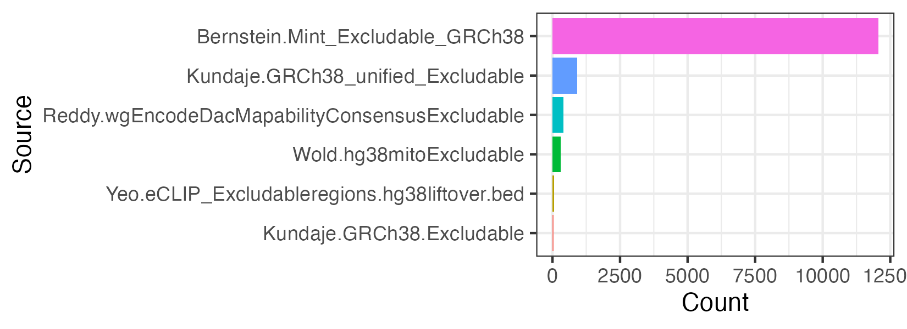
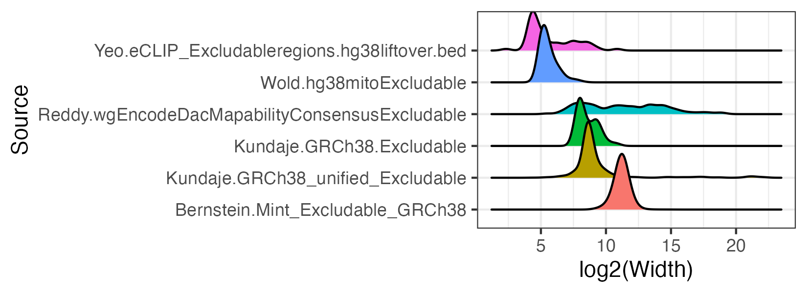
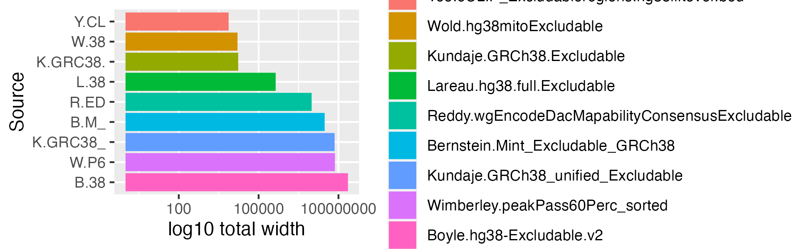
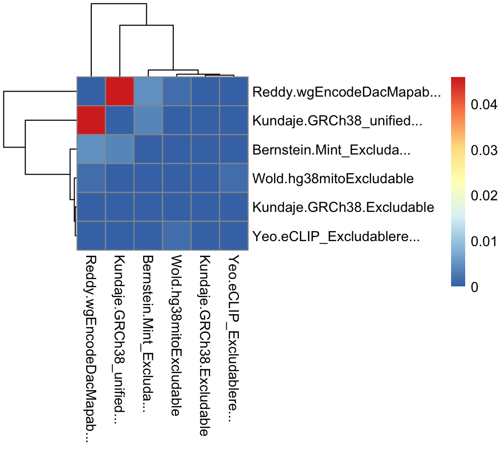
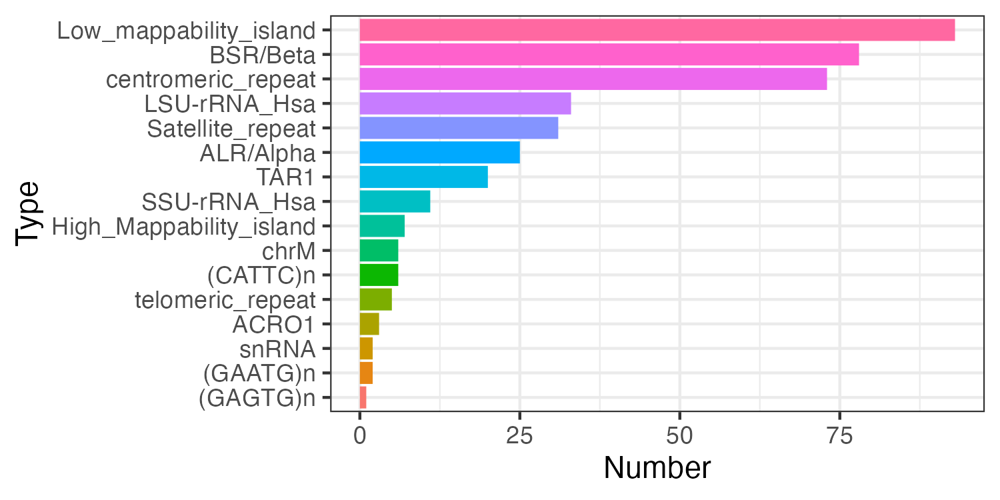
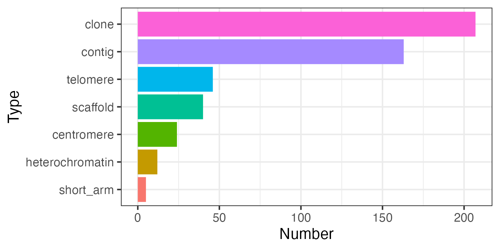

<!-- README.md is generated from README.Rmd. Please edit that file -->

```{r, include = FALSE}
knitr::opts_chunk$set(
    collapse = TRUE,
    comment = "#>",
    fig.path = "man/figures/README-",
    out.width = "100%"
)
library(BiocStyle)
```

# excluderanges, genomic ranges of problematic genomic regions


Coordinates of problematic genomic regions that should be avoided when 
working with genomic data. For human, mouse, and selected model organisms.

<!-- badges: start
[](https://lifecycle.r-lib.org/articles/stages.html#experimental)
badges: end -->

**New** - Exclusion sets for human [T2T-CHM13](http://bedbase.org/#/bedsplash/6548a002754cc1e882035293541b59a8) 
and mouse [GRCm39/mm39](http://bedbase.org/#/bedsplash/edc716833d4b5ee75c34a0692fc353d5) 
genome assemblies are available.
 
**TL;DR** - For human hg38 genome assembly, [Anshul](https://twitter.com/anshulkundaje/status/1263546023151992832?s=20) 
and we recommend [ENCFF356LFX exclusion list regions](https://www.encodeproject.org/files/ENCFF356LFX/).
Also available as `hg38.Kundaje.GRCh38_unified_Excludable` excluderanges object
(AnnotationHub ID: AH95917)
and [BEDbase.org](http://bedbase.org/#/bedsplash/1a561729234c2844303a051b16f66656).

BED files of exclusion regions are available on the [ENCODE project](https://www.encodeproject.org/search/?searchTerm=exclusion+list)
website and scattered across various websites, such as 
[Blacklist](https://github.com/Boyle-Lab/Blacklist/tree/master/lists) [@Amemiya:2019aa],
[Peakpass](https://github.com/ewimberley/peakPass/tree/main/excludedlists) [@Wimberley:2019ub],
[Greenscreen](https://github.com/sklasfeld/GreenscreenProject/tree/main/data) [@Klasfeld2022-nn]. 
Human and mouse genome assemblies have the largest number of exclusion sets 
generated by multiple labs. These exclusion sets frequently lack annotation and 
curation methods, creating uncertainty what to use. The purpose of this package 
is to provide a unified place for informed retrieval of exclusion regions.

Naming convention: `<genome assembly>.<lab>.<original file name>`, e.g.,
`hg19.Birney.wgEncodeDacMapabilityConsensusExcludable`.

See [make-data.R](inst/scripts/make-data.R) how we created excluderanges objects.

# Install `excluderanges`

```{r "install", eval = FALSE}
if (!requireNamespace("BiocManager", quietly = TRUE)) {
    install.packages("BiocManager")
}
# Install the development version of Bioconductor (need 3.15 or above)
# BiocManager::install(version = "devel")
# Check that you have a valid Bioconductor installation
# BiocManager::valid()
# Install the package
BiocManager::install("excluderanges", version = "devel")

# BiocManager::install("dozmorovlab/excluderanges")
```

# Use excluderanges

Get an overview of what's available

```{r AnnotationHub}
suppressMessages(library(GenomicRanges))
suppressMessages(library(AnnotationHub))
ah <- AnnotationHub()
query_data <- query(ah, "excluderanges")
# You can search for multiple terms
# query_data <- query(ah, c("excluderanges", "Kundaje"))
query_data
```

hg38 excluderanges coordinates recommended by Anshul

```{r hg38excluderanges}
# Check titles
# as.data.frame(mcols(query_data[1:10])["title"]) 
excludeGR.hg38.Kundaje.1 <- query_data[["AH95917"]]
# Always a good idea to sort GRanges and keep standard chromosomes
excludeGR.hg38.Kundaje.1 <- excludeGR.hg38.Kundaje.1 %>% 
  sort() %>% keepStandardChromosomes(pruning.mode = "tidy")
excludeGR.hg38.Kundaje.1
```

Save the data in a BED file, if needed.

```{r eval=FALSE}
# Note that rtracklayer::import and rtracklayer::export perform unexplained
# start coordinate conversion, likely related to 0- and 1-based coordinate
# system. We recommend converting GRanges to a data frame and save tab-separated
readr::write_tsv(as.data.frame(excludeGR.hg38.Kundaje.1), 
                 file = "hg38.Kundaje.GRCh38_unified_Excludable.bed",
                 col_names = FALSE)
```


We can load other excludable regions for the hg38 genome assembly and compare them.

```{r allhg38excluderanges}
query_data <- query(ah, c("excluderanges", "hg38", "Exclusion regions"))
query_data
excludeGR.hg38.Bernstein <- query_data[["AH95915"]]
excludeGR.hg38.Kundaje.2 <- query_data[["AH95916"]]
excludeGR.hg38.Reddy     <- query_data[["AH95918"]]
excludeGR.hg38.Wold      <- query_data[["AH95919"]]
excludeGR.hg38.Yeo       <- query_data[["AH95920"]]
```

## Compare the number of excludable regions

```{r excluderanges_hg38_count, fig.width=6.5, fig.height=2}
library(ggplot2)
mtx_to_plot <- data.frame(Count = c(length(excludeGR.hg38.Bernstein), 
                                    length(excludeGR.hg38.Kundaje.1), 
                                    length(excludeGR.hg38.Kundaje.2), 
                                    length(excludeGR.hg38.Reddy), 
                                    length(excludeGR.hg38.Wold), 
                                    length(excludeGR.hg38.Yeo)),
                          Source = c("Bernstein.Mint_Excludable_GRCh38", 
                                     "Kundaje.GRCh38_unified_Excludable", 
                                     "Kundaje.GRCh38.Excludable", 
                                     "Reddy.wgEncodeDacMapabilityConsensusExcludable", 
                                     "Wold.hg38mitoExcludable", 
                                     "Yeo.eCLIP_Excludableregions.hg38liftover.bed"))
# Order Source by the number of regions
mtx_to_plot$Source <- factor(mtx_to_plot$Source, levels = mtx_to_plot$Source[order(mtx_to_plot$Count)])

ggplot(mtx_to_plot, aes(x = Source, y = Count, fill = Source)) +
  geom_bar(stat = "identity") +
  coord_flip() +
  theme_bw() + theme(legend.position = "none")
# ggsave("man/figures/excluderanges_hg38_count.png", width = 5.5, height = 2)
```

```{r echo=FALSE, eval=FALSE}

```

## Compare the width of excludable regions

log2 scale because of heavy right tail distributions.

```{r excluderanges_hg38_width, fig.width=6.5, fig.height=2}
library(ggridges)
mtx_to_plot <- data.frame(Width = c(width(excludeGR.hg38.Bernstein), 
                                    width(excludeGR.hg38.Kundaje.1), 
                                    width(excludeGR.hg38.Kundaje.2), 
                                    width(excludeGR.hg38.Reddy), 
                                    width(excludeGR.hg38.Wold), 
                                    width(excludeGR.hg38.Yeo)),
                          Source = c(rep("Bernstein.Mint_Excludable_GRCh38", length(excludeGR.hg38.Bernstein)),
                                     rep("Kundaje.GRCh38_unified_Excludable", length(excludeGR.hg38.Kundaje.1)),
                                     rep("Kundaje.GRCh38.Excludable", length(excludeGR.hg38.Kundaje.2)),
                                     rep("Reddy.wgEncodeDacMapabilityConsensusExcludable", length(excludeGR.hg38.Reddy)),
                                     rep("Wold.hg38mitoExcludable", length(excludeGR.hg38.Wold)),
                                     rep("Yeo.eCLIP_Excludableregions.hg38liftover.bed", length(excludeGR.hg38.Yeo))))

ggplot(mtx_to_plot, aes(x = log2(Width), y = Source, fill = Source)) +
  geom_density_ridges() +
  theme_bw() + theme(legend.position = "none")
# ggsave("man/figures/excluderanges_hg38_width.png", width = 5.5, height = 2)
```

```{r echo=FALSE, eval=FALSE}

```

We can investigate the total width of each set of excludable ranges.

```{r excluderanges_hg38_sumwidth, fig.width=6.5, fig.height=2}
mtx_to_plot <- data.frame(TotalWidth = c(sum(width(excludeGR.hg38.Bernstein)), 
                                         sum(width(excludeGR.hg38.Kundaje.1)), 
                                         sum(width(excludeGR.hg38.Kundaje.2)), 
                                         sum(width(excludeGR.hg38.Reddy)), 
                                         sum(width(excludeGR.hg38.Wold)), 
                                         sum(width(excludeGR.hg38.Yeo))), 
                          Source = c("Bernstein.Mint_Excludable_GRCh38", 
                                     "Kundaje.GRCh38_unified_Excludable", 
                                     "Kundaje.GRCh38.Excludable", 
                                     "Reddy.wgEncodeDacMapabilityConsensusExcludable", 
                                     "Wold.hg38mitoExcludable", 
                                     "Yeo.eCLIP_Excludableregions.hg38liftover"))
ggplot(mtx_to_plot, aes(x = TotalWidth, y = Source, fill = Source)) + 
  geom_bar(stat="identity") + scale_x_log10() + scale_y_discrete(label=abbreviate) +
  xlab("log10 total width")
# ggsave("man/figures/excluderanges_hg38_sumwidth.png", width = 6.5, height = 2)
```

```{r echo=FALSE, eval=FALSE}

```

## Compare overlaps among sets

We can compare [overlap coefficients](https://en.wikipedia.org/wiki/Overlap_coefficient) 
between those sets of excludable regions.

```{r excluderanges_hg38_overlap_coefficient, warning=FALSE, fig.width=6.5, fig.height=6}
library(pheatmap)
library(stringr)
# Overlap coefficient calculations
overlap_coefficient <- function(gr_a, gr_b) {
  intersects <- GenomicRanges::intersect(gr_a, gr_b, ignore.strand = TRUE)
  intersection_width <- sum(width(intersects))
  min_width <- min(sum(width(gr_a)), sum(width(gr_b)))
  DataFrame(intersection_width, min_width, 
            overlap_coefficient = intersection_width/min_width,
             n_intersections = length(intersects))
}
# List and names of all excludable regions
all_excludeGR_list <- list(excludeGR.hg38.Bernstein, 
                        excludeGR.hg38.Kundaje.1, 
                        excludeGR.hg38.Kundaje.2,
                        excludeGR.hg38.Reddy,
                        excludeGR.hg38.Wold,
                        excludeGR.hg38.Yeo)
all_excludeGR_name <- c("Bernstein.Mint_Excludable_GRCh38", 
                     "Kundaje.GRCh38_unified_Excludable", 
                     "Kundaje.GRCh38.Excludable", 
                     "Reddy.wgEncodeDacMapabilityConsensusExcludable", 
                     "Wold.hg38mitoExcludable", 
                     "Yeo.eCLIP_Excludableregions.hg38liftover")
# Correlation matrix, empty
mtx_to_plot <- matrix(data = 0, nrow = length(all_excludeGR_list), ncol = length(all_excludeGR_list))
# Fill it in
for (i in 1:length(all_excludeGR_list)) {
  for (j in 1:length(all_excludeGR_list)) {
    # If diagonal, set to zero
    if (i == j) mtx_to_plot[i, j] <- 0
    # Process only one half, the other is symmetric
    if (i > j) {
      mtx_to_plot[i, j] <- mtx_to_plot[j, i] <- overlap_coefficient(all_excludeGR_list[[i]], all_excludeGR_list[[j]])[["overlap_coefficient"]]
    }
  }
}
# Trim row/colnames
rownames(mtx_to_plot) <- colnames(mtx_to_plot) <- str_trunc(all_excludeGR_name, width = 25) 
# Save the plot
# png("man/figures/excluderanges_hg38_jaccard.png", width = 1000, height = 900, res = 200)
pheatmap(data.matrix(mtx_to_plot))
# dev.off()
```

```{r echo=FALSE, eval=FALSE}

```

## Metadata analysis

Note that some excludable ranges objects contain six columns, implying there may be 
some interesting metadata. Let's explore one.

```{r excluderanges_hg38_Reddy_metadata, fig.width=6.5, fig.height=3}
mcols(excludeGR.hg38.Reddy)
mtx_to_plot <- table(mcols(excludeGR.hg38.Reddy)[["name"]]) %>%
  as.data.frame()
colnames(mtx_to_plot) <- c("Type", "Number")
mtx_to_plot <- mtx_to_plot[order(mtx_to_plot$Number), ]
mtx_to_plot$Type <- factor(mtx_to_plot$Type, 
                           levels = mtx_to_plot$Type)
ggplot(mtx_to_plot, aes(x = Number, y = Type, fill = Type)) +
  geom_bar(stat="identity") +
  theme_bw() + theme(legend.position = "none")
# ggsave("man/figures/excluderanges_hg38_Reddy_metadata.png", width = 5, height = 2.5)
```

```{r echo=FALSE, eval=FALSE}

```

One may decide to combine the excludable ranges from all labs, although from previous 
results we may decide to follow Anshul's [advice](https://twitter.com/anshulkundaje/status/1263546023151992832?s=20) advice about the [ENCFF356LFX exclusion list regions](https://www.encodeproject.org/files/ENCFF356LFX/) 
and use the `excludeGR.hg38.Kundaje.1` object.

```{r combinedexcluderanges}
excludeGR.hg38.all <- reduce(c(excludeGR.hg38.Bernstein, 
                               excludeGR.hg38.Kundaje.1, 
                               excludeGR.hg38.Kundaje.2, 
                               excludeGR.hg38.Reddy, 
                               excludeGR.hg38.Wold, 
                               excludeGR.hg38.Yeo))
# Sort and Keep only standard chromosomes
excludeGR.hg38.all <- excludeGR.hg38.all %>% sort %>% 
  keepStandardChromosomes(pruning.mode = "tidy")
print(length(excludeGR.hg38.all))
summary(width(excludeGR.hg38.all))
```

# BEDbase data download

[BEDbase.org](http://bedbase.org/) is a repository for storing and analyzing
BED files and BED sets, developed by [Sheffield lab](https://databio.org/). 
It provides API for data access and retrieval. 

Using BEDbase ID (e.g., `1a561729234c2844303a051b16f66656` for the 
`hg38.Kundaje.GRCh38_unified_Excludable` excluderanges object), we can construct
a URL showing the splash screen with detailed information of the corresponding
object, http://bedbase.org/#/bedsplash/1a561729234c2844303a051b16f66656.
We can also get the BED data.

```{r}
suppressMessages(library(httr))
suppressMessages(library(hca))
# bedbase_id
bedbase_id <- "1a561729234c2844303a051b16f66656"
# API token for metadata, we need object "Name"
token1 <- paste0("http://bedbase.org/api/bed/", bedbase_id, "/metadata")
q1 <- GET(token1)
cc1 = httr::content(q1)
# Simplify returned data
lcc1 = lol(cc1) # list of lists
# # Optionally, explore the data
# lol_path(lcc1)
# # Column names
# (lcc1_cols <- lol_pull(lcc1, "columns[*]"))
# # Data for those columns
# (lcc1_data <- lol_lpull(lcc1, "data[*][*]"))
```

```{r eval=FALSE}
# Construct output file name
fileNameOut <- paste0(lol_pull(lcc1, "data[*][*].Name"), ".bed")
# API token for BED data
token2 <- paste0("http://bedbase.org/api/bed/", bedbase_id, "/file/bed")
# Download file
GET(url = token2, write_disk(fileNameOut, overwrite = TRUE)) # , verbose()
```

# Mitochondrial DNA sequences, NUMTs

Mitochondrial DNA sequences (mtDNA, 100-600K mitochondria per human cell) 
transferred to the nucleus give rise to the so-called mitochondrial DNA 
sequences in the nuclear genome (NUMTs). In the settings of DNA/chromatin 
sequencing (e.g., ATAC-seq), we may observe up to 80% of mitochondrial 
sequencing reads that may pile up in the NUMT sequences. Similar to exclusion 
sets, genomic regions highly homologous to mtDNA can be masked to improve 
biological signal. 

The reference human nuclear mitochondrial sequences have been available in 
the UCSC genome browser for hg19 and mm8 human/mouse genome assemblies. 
We collected NUMT sets for hg38, T2T-CHM13, mm10, generated by Caleb Lareau 
in the [mitoblacklist](https://github.com/caleblareau/mitoblacklist) GitHub repository. 
These NUMT sets can be combined with exclusion sets.

Example of the  `hg38.Lareau.hg38_peaks` object

```{r}
# Get hg38.Lareau.hg38_peaks BEDbase ID
bedbase_id <- "9fa55701a3bd3e7a598d1d2815e3390f"
# Construct output file name
fileNameOut <- "hg38.Lareau.hg38_peak.bed"
# API token for BED data
token2 <- paste0("http://bedbase.org/api/bed/", bedbase_id, "/file/bed")
# Download file
GET(url = token2, write_disk(fileNameOut, overwrite = TRUE)) # , verbose()
# Read the data in
hg38.Lareau.hg38_peaks <- readr::read_tsv(fileNameOut, 
                                          col_names = FALSE,
                                          col_types = c("cddcdc"))
# Assign column names depending on the number of columns
all_columns <- c("chr", "start", "stop", "name", "score", "strand", 
                 "signalValue", "pValue", "qValue", "peak")
colnames(hg38.Lareau.hg38_peaks) <- all_columns[1:ncol(hg38.Lareau.hg38_peaks)]
# Convert to GRanges object
hg38.Lareau.hg38_peaks <- makeGRangesFromDataFrame(hg38.Lareau.hg38_peaks, 
                                                   keep.extra.columns = TRUE)
hg38.Lareau.hg38_peaks
```

# Centromeres, telomeres, etc.

Besides the ENCODE-produced excludable regions, we may want to exclude centromeres,
telomeres, and other gap locations. The "Gap Locations" track for Homo Sapiens 
is available for the GRcH37/hg19 genome assembly as a [UCSC 'gap' table](http://genome.ucsc.edu/cgi-bin/hgTables?db=hg19&hgta_group=map&hgta_track=gap&hgta_table=gap&hgta_doSchema=describe+table+schema).
It can be retrieved from `r BiocStyle::Biocpkg("AnnotationHub")`, but lacks 
the metadata columns needed to decide the type of gaps.

```{r eval=FALSE}
# Search for the gap track
# ahData <- query(ah, c("gap", "Homo sapiens", "hg19"))
# ahData[ahData$title == "Gap"]
gaps <- ahData[["AH6444"]]
```


The [UCSC 'gap' table](http://genome.ucsc.edu/cgi-bin/hgTables?db=hg19&hgta_group=map&hgta_track=gap&hgta_table=gap&hgta_doSchema=describe+table+schema) provides better granularity
about the types of gaps available. E.g., for human, hg19, we have the following
types and the number of gaps.

```{r gapcounts, echo=FALSE, out.height="70%", out.width="70%"}
suppressMessages(library(rtracklayer))
# 
# Get genome-specific gaps table
mySession <- browserSession()
genome(mySession) <- "hg19"
query <- ucscTableQuery(mySession, table = "gap")
gaps <- getTable(query)
# Number of regions per gap type
mtx_to_plot <- as.data.frame(table(gaps$type))
colnames(mtx_to_plot) <- c("Type", "Number")
mtx_to_plot <- mtx_to_plot[order(mtx_to_plot$Number), ]
mtx_to_plot$Type <- factor(mtx_to_plot$Type, levels = mtx_to_plot$Type)
ggplot(mtx_to_plot, aes(x = Number, y = Type, fill = Type)) +
  geom_bar(stat="identity") +
  theme_bw() + theme(legend.position = "none")
# ggsave("man/figures/excluderanges_hg19_gaps_number.png", width = 5, height = 2.5)
```

Those objects are provided as individual GRanges.

Naming convention: `<genome assembly>.UCSC.<gap type>`, e.g.,
`hg19.UCSC.gap_centromere`. We can similarly load any gap type object.

```{r gapshg19}
query_data <- query(ah, c("excluderanges", "UCSC", "Homo Sapiens", "hg19"))
query_data

gapsGR_hg19_centromere <- query_data[["AH95927"]]
gapsGR_hg19_centromere
```

# Summary table

[Full summary table](inst/extdata/Table_S1.csv). Download all data from the [Google Drive folder](https://drive.google.com/drive/folders/1sF9m8Y3eZouTZ3IEEywjs2kfHOWFBSJT?usp=sharing)

```{r echo=FALSE}
mtx <- read.csv("inst/extdata/Table_S1.csv")
mtx$BEDbase.URL <- ifelse(!is.na(mtx$BEDbase.ID), paste0("[link](http://bedbase.org/#/bedsplash/", mtx$BEDbase.ID, ")"), "NA")
knitr::kable(mtx[, c("Name", "AnnotationHub.ID", "BEDbase.URL", "Description", "Filtered.Region.count")])
```

# Citation

Below is the citation output from using `citation('excluderanges')` in R. Please
run this yourself to check for any updates on how to cite __excluderanges__.

```{r 'citation', eval = requireNamespace('excluderanges')}
print(citation("excluderanges"), bibtex = TRUE)
```

# Code of Conduct

Please note that the `excluderanges` project is released with a [Contributor Code of Conduct](https://bioconductor.github.io/bioc_coc_multilingual/). By contributing to this project, you agree to abide by its terms.

This package was developed using `r BiocStyle::Biocpkg('biocthis')`.

# References
