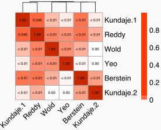

<!-- README.md is generated from README.Rmd. Please edit that file -->

# excluderanges 

Genomic ranges of problematic genomic regions that should be avoided
when working with genomic data. For human, mouse, and selected model
organisms.

<!-- badges: start
[](https://lifecycle.r-lib.org/articles/stages.html#experimental)
badges: end -->

TL;DR - For human hg38 genome assembly,
[Anshul](https://twitter.com/anshulkundaje)
[recommends](https://twitter.com/anshulkundaje/status/1263546023151992832?s=20)
[ENCFF356LFX exclusion list
regions](https://www.encodeproject.org/files/ENCFF356LFX/).

BED files of exclusion regions are available on the [ENCODE
project](https://www.encodeproject.org/search/?searchTerm=exclusion+list)
website (Amemiya, Kundaje, and Boyle 2019) and throughout
[Github](https://github.com). *Homo sapien* (hg19, hg38, and T2T
(presented here) ), *Mus musculus* (mm9, mm10), *Caenorhabditis elegans*
(ce10, ce11), *Drosophila melanogaster* (dm3, dm6), *Arabidopsis
thaliana* (TAIR10), and *Danio rerio* (danRer10) exclusion regions are
available. However, exclusion lists generated by multiple labs using
different methods produce a variety of results. With so many choices and
such variety, choosing an excludable set is an open question. The
purpose of this package is to provide a unified place for informed
retrieval of excludable regions.

Naming convention: `<genome assembly>.<lab>.<original file name>`, e.g.,
`hg19.Birney.wgEncodeDacMapabilityConsensusExcludable`.

See [make-data.R](inst/scripts/make-data.R) how to create the
excluderanges GRanges objects.

## Install `excluderanges`

``` r
if (!requireNamespace("BiocManager", quietly = TRUE)) {
    install.packages("BiocManager")
}
# Install the development version of Bioconductor (need 3.14 and above)
# BiocManager::install(version = "devel")
# Check that you have a valid Bioconductor installation
# BiocManager::valid()
# Install the package
BiocManager::install("excluderanges", version = "devel")

# BiocManager::install("mdozmorov/excluderanges")
```

## Use excluderanges

An overview of what’s available:

``` r
suppressMessages(library(AnnotationHub))
ah <- AnnotationHub()
#> snapshotDate(): 2022-04-21
query_data <- query(ah, "excluderanges")
query_data
#> AnnotationHub with 42 records
#> # snapshotDate(): 2022-04-21
#> # $dataprovider: UCSC, ENCODE, mitra.stanford.edu/kundaje/akundaje/release/b...
#> # $species: Homo sapiens, Mus musculus, Drosophila melanogaster, Caenorhabdi...
#> # $rdataclass: GRanges
#> # additional mcols(): taxonomyid, genome, description,
#> #   coordinate_1_based, maintainer, rdatadateadded, preparerclass, tags,
#> #   rdatapath, sourceurl, sourcetype 
#> # retrieve records with, e.g., 'object[["AH95908"]]' 
#> 
#>             title                                                    
#>   AH95908 | ce10.Kundaje.ce10-Excludable.rds                         
#>   AH95909 | dm3.Kundaje.dm3-Excludable.rds                           
#>   AH95910 | hg19.Bernstein.Mint_Excludable_hg19.rds                  
#>   AH95911 | hg19.Birney.wgEncodeDacMapabilityConsensusExcludable.rds 
#>   AH95912 | hg19.Crawford.wgEncodeDukeMapabilityRegionsExcludable.rds
#>   ...       ...                                                      
#>   AH95945 | mm10.UCSC.telomere.rds                                   
#>   AH95946 | mm9.UCSC.centromere.rds                                  
#>   AH95947 | mm9.UCSC.contig.rds                                      
#>   AH95948 | mm9.UCSC.fragment.rds                                    
#>   AH95949 | mm10.UCSC.scaffold.rds
```

hg38 excluderanges coordinates recommended by Anshul:
<!-- Need to check if this is Kundaje unified, i.e. https://www.encodeproject.org/files/ENCFF356LFX/ -->

``` r
# Check titles
# as.data.frame(mcols(query_data[1:10])["title"]) 
excludeGR.hg38.Kundaje.1 <- query_data[["AH95917"]]
#> loading from cache
#> require("GenomicRanges")
excludeGR.hg38.Kundaje.1
#> GRanges object with 910 ranges and 0 metadata columns:
#>         seqnames            ranges strand
#>            <Rle>         <IRanges>  <Rle>
#>     [1]     chr1     628903-635104      *
#>     [2]     chr1   5850087-5850571      *
#>     [3]     chr1   8909610-8910014      *
#>     [4]     chr1   9574580-9574997      *
#>     [5]     chr1 32043823-32044203      *
#>     ...      ...               ...    ...
#>   [906]     chrY 11290797-11334278      *
#>   [907]     chrY 11493053-11592850      *
#>   [908]     chrY 11671014-11671046      *
#>   [909]     chrY 11721528-11749472      *
#>   [910]     chrY 56694632-56889743      *
#>   -------
#>   seqinfo: 24 sequences from hg38 genome
```

Save the data in a BED file, if needed.

``` r
rtracklayer::export(excludeGR.hg38.Kundaje.1, "hg38.Kundaje.GRCh38_unified_Excludable.bed", format = "bed")
```

We can load other excludable regions for the hg38 genome assembly and
compare them.
<!-- THIS LIST NEEDS TO BE UPDATED ONCE ALL SETS ARE ON ANNOTATION HUB -->
<!-- THIS LIST NEEDS TO BE UPDATED ONCE ALL SETS ARE ON ANNOTATION HUB -->
<!-- THIS LIST NEEDS TO BE UPDATED ONCE ALL SETS ARE ON ANNOTATION HUB -->
<!-- THIS LIST NEEDS TO BE UPDATED ONCE ALL SETS ARE ON ANNOTATION HUB -->

``` r
query_data <- query(ah, c("excluderanges", "hg38", "Exclusion regions"))
query_data
#> AnnotationHub with 6 records
#> # snapshotDate(): 2022-04-21
#> # $dataprovider: ENCODE
#> # $species: Homo sapiens
#> # $rdataclass: GRanges
#> # additional mcols(): taxonomyid, genome, description,
#> #   coordinate_1_based, maintainer, rdatadateadded, preparerclass, tags,
#> #   rdatapath, sourceurl, sourcetype 
#> # retrieve records with, e.g., 'object[["AH95915"]]' 
#> 
#>             title                                                       
#>   AH95915 | hg38.Bernstein.Mint_Excludable_GRCh38.rds                   
#>   AH95916 | hg38.Kundaje.GRCh38.Excludable.rds                          
#>   AH95917 | hg38.Kundaje.GRCh38_unified_Excludable.rds                  
#>   AH95918 | hg38.Reddy.wgEncodeDacMapabilityConsensusExcludable.hg38.rds
#>   AH95919 | hg38.Wold.hg38mitoExcludable.rds                            
#>   AH95920 | hg38.Yeo.eCLIP_Excludableregions.hg38liftover.bed.fixed.rds
excludeGR.hg38.Bernstein <- query_data[["AH95915"]]
#> loading from cache
excludeGR.hg38.Kundaje.2 <- query_data[["AH95916"]]
#> loading from cache
excludeGR.hg38.Reddy     <- query_data[["AH95918"]]
#> loading from cache
excludeGR.hg38.Wold      <- query_data[["AH95919"]]
#> loading from cache
excludeGR.hg38.Yeo       <- query_data[["AH95920"]]
#> loading from cache

all_excludeGR_list <- list(
  excludeGR.hg38.Bernstein, 
  excludeGR.hg38.Kundaje.1, 
  excludeGR.hg38.Kundaje.2,
  excludeGR.hg38.Reddy,     
  excludeGR.hg38.Wold,      
  excludeGR.hg38.Yeo       
)

name_short <- c(
  "Berstein",
  "Kundaje.1",
  "Kundaje.2",
  "Reddy",
  "Wold",
  "Yeo"
)
```

Compare the total number of excludable regions.

``` r
library(ggplot2)


length_data<- data.frame(
  Set = name_short,
  Count = sapply(all_excludeGR_list, function(x) length(x))
)

length <- ggplot(length_data, aes(x = Count, y = reorder(Set, Count), fill = Set)) + 
  ylab("") +
  geom_bar(stat="identity") + 
  xlab('') +
  ggtitle("Number of Regions") +
  theme_bw() +
  theme(legend.position = "none")

length


# svg(file.path('man', 'figures', 'excluderanges_hg38_count.svg'), width = 5.5, height = 2)
# length
# dev.off()
```


Compare the log10(width) distributions of excludable regions.

``` r
library(ggridges)

# find the width distribution of each excludable set
Width = as.integer(
  unlist(
    lapply(all_excludeGR_list, function(x) as.integer(width(x)))
  )
)

# each distribution needs a name assigned to it
Source <- as.character(
  unlist(
    mapply(function(name, grange_object) rep(name, length(grange_object)), name_short, all_excludeGR_list)
  )
)

Median <- as.integer(
  unlist(
    lapply(all_excludeGR_list, function(set) rep( median(width(set)), length(set) ))
  )
)

# make width distribution dataframe
width_dist_data <- data.frame(Width, Source, Median)

# plot distribution of region widths
width_dist <- ggplot(width_dist_data, aes( x = log10(Width), y = reorder( Source, Median ), fill = Source )) +
  ggridges::geom_density_ridges() +
  labs( y = NULL,
        x = NULL,
        title = 'Width distribution (bp), log10(width)' ) +
  theme_bw() +
  theme(legend.position = 'none')

width_dist


# svg(file.path('man', 'figures', 'excluderanges_hg38_width.svg'), width = 5.5, height = 2)
# width_dist
# dev.off()
```


We can investigate the total width of each set of excludable ranges, log
10 scale.

``` r
width_data<- data.frame(
  Set = name_short,
  Count = sapply(all_excludeGR_list, function(x) sum(width(x)))
)

# find the total width of each excludable region
coverage <- ggplot(width_data, aes(x = Count, y = reorder(Set, Count), fill = Set)) + 
  labs(y = NULL,
       x = NULL,
       title = "Total Coverage, log10 scale") +
  geom_bar(stat="identity") +
  scale_x_log10()  +
  theme_bw() +
  theme(legend.position = "none")

coverage


# svg(file.path('man', 'figures', 'excluderanges_hg38_sumwidth.svg'), width = 5.5, height = 2)
# coverage
# dev.off()
```


We can compare Jaccard overlap between hg38 excludable sets.

``` r
library(pheatmap)
library(stringr)

# Jaccard calculations
jaccard <- function(gr_a, gr_b) {
  intersects <- GenomicRanges::intersect(gr_a, gr_b, ignore.strand = TRUE)
  intersection <- sum(width(intersects))
  union <- sum(width(GenomicRanges::union(gr_a, gr_b, ignore.strand = TRUE)))
  DataFrame(intersection, union, 
            jaccard = intersection/union,
             n_intersections = length(intersects))
}
# Correlation matrix, empty
mtx_to_plot <- matrix(data = 0, nrow = length(all_excludeGR_list), ncol = length(all_excludeGR_list))

suppressWarnings(
  # Fill it in
  for (i in 1:length(all_excludeGR_list)) {
    for (j in 1:length(all_excludeGR_list)) {
      # If diagonal, set to zero
      if (i == j) mtx_to_plot[i, j] <- 1 
      # Process only one half, the other is symmetric
      if (i > j) {
        mtx_to_plot[i, j] <- mtx_to_plot[j, i] <- jaccard(all_excludeGR_list[[i]], all_excludeGR_list[[j]])[["jaccard"]]
      }
    }
  }
)


##### NUMBER FORMATTING ######

nicer.numbers <- matrix(
  data = 0,
  ncol = ncol(mtx_to_plot),
  nrow = nrow(mtx_to_plot)
)

# we want to view these numbers NOT in scientific notation
nicer.numbers[which(mtx_to_plot==1)] <- '1.00'
nicer.numbers[which(mtx_to_plot==0)] <- '0.00'


# for each jaccard value that isn't 0 or 1...
for (i in which(mtx_to_plot > 0 & mtx_to_plot < 1) ){

  # if corresponding cell in actual matrix is more than 0.01
  ifelse(mtx_to_plot[i] > 0.01,

         # round two decimal places and format normal
         nicer.numbers[i] <- as.character(
           format(
             as.numeric( mtx_to_plot[i] ),
             scientific = F,
             digits = 2
           )
         ),

         # otherwise label as less than 0.01
         nicer.numbers[i] <- as.character('< 0.01')
  )
}

##### PLOTTING #####

# get quantiles of all values, used for creating a nice gradient
vals <- mtx_to_plot[-which(mtx_to_plot==1)]

quants <- quantile(vals, probs = seq(0, 1, 0.1))

# to distinguish lowest value from absolute 0
quants <- append(quants, 0.000000001)
# to distinguish highest values
quants <- append(quants, 0.999999999)
quants <- sort(unique(quants))
quants
#>  [1] 0.000000e+00 1.000000e-09 1.873802e-06 2.153054e-04 2.347744e-04
#>  [6] 2.657863e-04 3.833759e-04 1.444043e-03 2.015477e-03 4.986820e-03
#> [11] 4.591066e-02 1.000000e+00
# create color gradient
cols.O <- c(
  '#FFFFFF',
  '#FFF7F5',
  '#FFEDE8',
  '#FFBDAB',
  '#FFB19C',
  '#FFA187',
  '#FF9173',
  '#FF8361',
  '#FF7752',
  '#FF6B42',
  '#FF3903',
  '#C72B00'
)

# Trim row/colnames
rownames(mtx_to_plot) <- colnames(mtx_to_plot) <- str_trunc(name_short, width = 25)

# change cell size of heatmap
cell.size = 30
text.size = cell.size/2

# create clusters
cluster.method <- "euclidean"

# plot matrix
jaccard <- pheatmap(

  # data
  data.matrix(mtx_to_plot),

  # clustering options
  clustering_method = "ward.D",
  clustering_distance_rows = cluster.method,
  clustering_distance_cols = cluster.method,

  # number options
  display_numbers = nicer.numbers,
  fontsize_number=cell.size/4,
  number_color = 'black',

  # cell formatting options
  cellwidth = cell.size,
  cellheight = cell.size,
  fontsize = text.size,

  # tree options
  treeheight_row = 0,
  treeheight_col = 20,

  # i.e. how fine is the resolution
  breaks = quants,

  # other
  legend = T,
  color = cols.O,
  angle_col = 45

)

jaccard


# svg(file.path('man', 'figures', 'excluderanges_hg38_jaccard.svg'), width = 5.5, height = 2)
# jaccard
# dev.off()
```



Note that some excludable ranges objects contain six columns, implying
there may be some interesting metadata. Let’s explore one.

``` r
mcols(excludeGR.hg38.Reddy)
#> DataFrame with 401 rows and 2 columns
#>                       name     score
#>                <character> <numeric>
#> 1   High_Mappability_isl..      1000
#> 2         Satellite_repeat      1000
#> 3                 BSR/Beta      1000
#> 4   Low_mappability_island      1000
#> 5                 (CATTC)n      1000
#> ...                    ...       ...
#> 397                   TAR1      1000
#> 398       Satellite_repeat      1000
#> 399               (CATTC)n      1000
#> 400               (CATTC)n      1000
#> 401                   TAR1      1000
mtx_to_plot <- as.data.frame(table(mcols(excludeGR.hg38.Reddy)[["name"]]))
colnames(mtx_to_plot) <- c("Type", "Number")
mtx_to_plot <- mtx_to_plot[order(mtx_to_plot$Number), ]
mtx_to_plot$Type <- factor(mtx_to_plot$Type, levels = mtx_to_plot$Type)
ggplot(mtx_to_plot, aes(x = Number, y = Type, fill = Type)) +
  geom_bar(stat="identity") +
  theme_bw() + theme(legend.position = "none")
```


``` r
# ggsave("man/figures/excluderanges_hg38_Reddy_metadata.png", width = 5, height = 2.5)
```

One may decide to combine the excludable ranges from all labs, although
from previous results we may decide to follow Anshul’s
[advice](https://twitter.com/anshulkundaje/status/1263546023151992832?s=20)
advice about the [ENCFF356LFX exclusion list
regions](https://www.encodeproject.org/files/ENCFF356LFX/) and use the
`excludeGR.hg38.Kundaje.1` object.

``` r
excludeGR.hg38.all <- reduce(c(excludeGR.hg38.Bernstein, excludeGR.hg38.Kundaje.1, excludeGR.hg38.Kundaje.2, excludeGR.hg38.Reddy, excludeGR.hg38.Wold, excludeGR.hg38.Yeo))
#> Warning in valid.GenomicRanges.seqinfo(x, suggest.trim = TRUE): GRanges object contains 1 out-of-bound range located on sequence
#>   chr4_GL000008v2_random. Note that ranges located on a sequence whose
#>   length is unknown (NA) or on a circular sequence are not considered
#>   out-of-bound (use seqlengths() and isCircular() to get the lengths and
#>   circularity flags of the underlying sequences). You can use trim() to
#>   trim these ranges. See ?`trim,GenomicRanges-method` for more
#>   information.
# Keep only standard chromosomes
excludeGR.hg38.all <- keepStandardChromosomes(excludeGR.hg38.all, pruning.mode = "coarse")
print(length(excludeGR.hg38.all))
#> [1] 13239
summary(width(excludeGR.hg38.all))
#>    Min. 1st Qu.  Median    Mean 3rd Qu.    Max. 
#>       5    1778    2306    8153    2859 5407757
```

## Centromeres, telomeres, etc.

Besides the ENCODE-produced excludable regions, we may want to exclude
centromeres, telomeres, and other gap locations. The “Gap Locations”
track for Homo Sapiens is available for the GRcH37/hg19 genome assembly
as a [UCSC ‘gap’
table](http://genome.ucsc.edu/cgi-bin/hgTables?db=hg19&hgta_group=map&hgta_track=gap&hgta_table=gap&hgta_doSchema=describe+table+schema).
It can be retrieved from
*[AnnotationHub](https://bioconductor.org/packages/3.15/AnnotationHub)*,
but lacks the metadata columns needed to decide the type of gaps.

``` r
# Search for the gap track
# ahData <- query(ah, c("gap", "Homo sapiens", "hg19"))
# ahData[ahData$title == "Gap"]
gaps <- ahData[["AH6444"]]
```

The [UCSC ‘gap’
table](http://genome.ucsc.edu/cgi-bin/hgTables?db=hg19&hgta_group=map&hgta_track=gap&hgta_table=gap&hgta_doSchema=describe+table+schema)
provides better granularity about the types of gaps available. E.g., for
human, hg19, we have the following types and the number of gaps.


Those objects are provided as individual GRanges.

Naming convention: `<genome assembly>.UCSC.<gap type>`, e.g.,
`hg19.UCSC.gap_centromere`.

We can similarly load any gap type object.

``` r
query_data <- query(ah, c("excluderanges", "UCSC", "Homo Sapiens", "hg19"))
query_data
#> AnnotationHub with 7 records
#> # snapshotDate(): 2022-04-21
#> # $dataprovider: UCSC
#> # $species: Homo sapiens
#> # $rdataclass: GRanges
#> # additional mcols(): taxonomyid, genome, description,
#> #   coordinate_1_based, maintainer, rdatadateadded, preparerclass, tags,
#> #   rdatapath, sourceurl, sourcetype 
#> # retrieve records with, e.g., 'object[["AH95927"]]' 
#> 
#>             title                        
#>   AH95927 | hg19.UCSC.centromere.rds     
#>   AH95928 | hg19.UCSC.clone.rds          
#>   AH95929 | hg19.UCSC.contig.rds         
#>   AH95930 | hg19.UCSC.heterochromatin.rds
#>   AH95931 | hg19.UCSC.scaffold.rds       
#>   AH95932 | hg19.UCSC.short_arm.rds      
#>   AH95933 | hg19.UCSC.telomere.rds

gapsGR_hg19_centromere <- query_data[["AH95927"]]
#> loading from cache
gapsGR_hg19_centromere
#> GRanges object with 24 ranges and 6 metadata columns:
#>       seqnames              ranges strand |       bin        ix           n
#>          <Rle>           <IRanges>  <Rle> | <numeric> <numeric> <character>
#>     2     chr1 121535434-124535434      * |        23      1270           N
#>   184    chr21   11288129-14288129      * |        10        22           N
#>   199    chr22   13000000-16000000      * |        10         3           N
#>   206    chr19   24681782-27681782      * |         1       410           N
#>   224     chrY   10104553-13104553      * |        10       105           N
#>   ...      ...                 ...    ... .       ...       ...         ...
#>   439     chr6   58830166-61830166      * |        16       628           N
#>   453     chr5   46405641-49405641      * |        14       452           N
#>   460     chr4   49660117-52660117      * |         1       447           N
#>   476     chr3   90504854-93504854      * |         2       784           N
#>   481     chr2   92326171-95326171      * |        20       770           N
#>            size        type      bridge
#>       <numeric> <character> <character>
#>     2     3e+06  centromere          no
#>   184     3e+06  centromere          no
#>   199     3e+06  centromere          no
#>   206     3e+06  centromere          no
#>   224     3e+06  centromere          no
#>   ...       ...         ...         ...
#>   439     3e+06  centromere          no
#>   453     3e+06  centromere          no
#>   460     3e+06  centromere          no
#>   476     3e+06  centromere          no
#>   481     3e+06  centromere          no
#>   -------
#>   seqinfo: 24 sequences from hg19 genome
```

### Centromeres for the hg38 genome assembly

Note that the UCSC ‘gap’ table for the hg38 human genome assembly does
not contain genomic coordinates for the “centromere” gap type. These can
be obtained from the
*[rCGH](https://bioconductor.org/packages/3.15/rCGH)* package as
follows:

``` r
suppressPackageStartupMessages(library(rCGH))
suppressPackageStartupMessages(library(GenomicRanges))
# hg38 # data.frame
# Adjust chromosome names
hg38$chrom[hg38$chrom == 23] <- "X"
hg38$chrom[hg38$chrom == 24] <- "Y"
hg38$chrom <- paste0("chr", hg38$chrom)
# Make GRanges object
hg38.UCSC.centromere <- makeGRangesFromDataFrame(hg38, seqnames.field = "chrom", start.field = "centromerStart", end.field = "centromerEnd")
# Assign seqinfo data
seqlengths(hg38.UCSC.centromere) <- hg38$length
genome(hg38.UCSC.centromere)     <- "hg38"
# Resulting object
hg38.UCSC.centromere
#> GRanges object with 24 ranges and 0 metadata columns:
#>        seqnames              ranges strand
#>           <Rle>           <IRanges>  <Rle>
#>    [1]     chr1 121535434-124535434      *
#>    [2]     chr2   92326171-95326171      *
#>    [3]     chr3   90504854-93504854      *
#>    [4]     chr4   49660117-52660117      *
#>    [5]     chr5   46405641-49405641      *
#>    ...      ...                 ...    ...
#>   [20]    chr20   26369569-29369569      *
#>   [21]    chr21   11288129-14288129      *
#>   [22]    chr22   13000000-16000000      *
#>   [23]     chrX   58632012-61632012      *
#>   [24]     chrY   10104553-13104553      *
#>   -------
#>   seqinfo: 24 sequences from hg38 genome
```

The *[rCGH](https://bioconductor.org/packages/3.15/rCGH)* package also
contains data for the `hg19` and `hg18` genomes. The `hg19` centromere
data is equivalent to the `hg19.UCSC.centromere` object provided in our
*[excluderanges](https://bioconductor.org/packages/3.15/excluderanges)*
package.

## Source data for the excludable regions

| Object                                                       | Assembly | Number of regions | Min : median : max of set   | Chromosomes with no excludable regions                  | Year_created | Source                                                                                                                   |
|:-------------------------------------------------------------|:---------|------------------:|:----------------------------|:--------------------------------------------------------|-------------:|:-------------------------------------------------------------------------------------------------------------------------|
| ce10.Boyle_from_Excludable.v2.Excludable.bed                 | ce10     |               100 | 1,301 : 5,401 : 1,130,801   | M                                                       |         2018 | <https://github.com/Boyle-Lab/Blacklist/blob/master/lists/ce10-blacklist.v2.bed.gz?raw=true>                             |
| ce10.Kundaje.ce10-Excludable.bed                             | ce10     |               122 | 1,001 : 2,201 : 25,801      | M                                                       |         2012 | <http://mitra.stanford.edu/kundaje/akundaje/release/blacklists/ce10-C.elegans>                                           |
| ce11.Boyle_from_Excludable.v2.Excludable.bed                 | ce11     |                97 | 1,301 : 5,001 : 47,501      | M                                                       |         2018 | <https://github.com/Boyle-Lab/Blacklist/blob/master/lists/ce11-blacklist.v2.bed.gz?raw=true>                             |
| danRer10.Domingues.Excludable.bed                            | danRer10 |                62 | 37 : 468.5 : 82,628         | 3, 6, 9, 10, 15, 19, 21, 22, 24, M                      |         2020 | <https://raw.githubusercontent.com/adomingues/redl_domingues_et_al_dev_2020/main/blacklisted.bed>                        |
| danRer10.Yang.Excludable.bed                                 | danRer10 |               853 | 410 : 1,170 : 6,033         | M                                                       |         2021 | <https://www.ncbi.nlm.nih.gov/pmc/articles/PMC8183574/bin/NIHMS1695157-supplement-Supplementary_Table_1-19.zip>          |
| dm3.Boyle_from_Excludable.v2.Excludable.bed                  | dm3      |               271 | 1,401 : 5,901 : 127,701     | M, U, Uextra                                            |         2018 | <https://github.com/Boyle-Lab/Blacklist/blob/master/lists/dm3-blacklist.v2.bed.gz>                                       |
| dm3.Kundaje.dm3-Excludable.bed                               | dm3      |               492 | 1,001 : 1,551 : 24,301      | M                                                       |         2012 | <http://mitra.stanford.edu/kundaje/akundaje/release/blacklists/dm3-D.melanogaster/>                                      |
| dm6.Boyle_from_Excludable.v2.Excludable.bed                  | dm6      |               182 | 1,201 : 7,401 : 236,601     | M                                                       |         2018 | <https://github.com/Boyle-Lab/Blacklist/blob/master/lists/dm6-blacklist.v2.bed.gz>                                       |
| hg19.Bernstein.Mint_Excludable_hg19.bed                      | hg19     |              9035 | 502 : 2,418 : 49,368        | X, Y, M, MT                                             |         2019 | <https://www.encodeproject.org/files/ENCFF200UUD/>                                                                       |
| hg19.Birney.wgEncodeDacMapabilityConsensusExcludable.bed     | hg19     |               411 | 42 : 2,567 : 1,400,396      | MT                                                      |         2011 | <https://www.encodeproject.org/files/ENCFF001TDO/>                                                                       |
| hg19.Boyle_from_Excludable.v2.Excludable.bed                 | hg19     |               834 | 1,101 : 9,351 : 30,590,101  | M, MT                                                   |         2018 | <https://github.com/Boyle-Lab/Blacklist/blob/master/lists/hg19-blacklist.v2.bed.gz?raw=true>                             |
| hg19.Crawford.wgEncodeDukeMapabilityRegionsExcludable.bed    | hg19     |              1649 | 21 : 612 : 160,603          | MT                                                      |         2011 | <https://www.encodeproject.org/files/ENCFF001THR/>                                                                       |
| hg19.Lareau_full.Excludable.bed                              | hg19     |               902 | 91 : 388 : 1,400,396        | M, MT                                                   |         2017 | <https://raw.githubusercontent.com/caleblareau/mitoblacklist/master/combinedBlacklist/mm10.full.blacklist.bed>           |
| hg19.Lareau_MT.excludable.bed                                | hg19     |               779 | 201 : 384 : 9,422           | Y, M, MT                                                |         2017 | <https://raw.githubusercontent.com/caleblareau/mitoblacklist/master/peaks/hg19_peaks.narrowPeak>                         |
| hg19.Wold.hg19mitoExcludable.bed                             | hg19     |               295 | 31 : 41 : 301               | 10, 15, 19, M, MT                                       |         2016 | <https://www.encodeproject.org/files/ENCFF055QTV/>                                                                       |
| hg19.Yeo.eCLIP_Excludableregions.hg19.bed                    | hg19     |                57 | 5 : 30 : 1,850              | 18, 21, Y, MT                                           |         2019 | <https://www.encodeproject.org/files/ENCFF039QTN/>                                                                       |
| hg38.Bernstein.Mint_Excludable_GRCh38.bed                    | hg38     |             12052 | 502 : 2,365 : 46,435        | M                                                       |         2019 | <https://www.encodeproject.org/files/ENCFF023CZC/>                                                                       |
| hg38.Kundaje.GRCh38_unified_Excludable.bed                   | hg38     |               910 | 20 : 385 : 5,407,757        | M                                                       |         2020 | <https://www.encodeproject.org/files/ENCFF356LFX/>                                                                       |
| hg38.Kundaje.GRCh38.Excludable.bed                           | hg38     |                38 | 221 : 301 : 1,761           | 6, 7, 8, 9, 11, 12, 13, 14, 15, 17, 18, 19, 22, X, Y, M |         2016 | <https://www.encodeproject.org/files/ENCFF419RSJ/>                                                                       |
| hg38.Kundaje.with_Boyle.v2.bed                               | hg38     |               636 | 1,201 : 10,151 : 30,590,101 | M                                                       |         2018 | <https://github.com/Boyle-Lab/Blacklist/blob/master/lists/hg38-blacklist.v2.bed.gz?raw=true>                             |
| hg38.Lareau_full.Excludable.bed                              | hg38     |               820 | 201 : 384 : 9,421           | Y, M                                                    |         2017 | <https://raw.githubusercontent.com/caleblareau/mitoblacklist/master/combinedBlacklist/hg38.full.blacklist.bed>           |
| hg38.Lareau.MT_excludable_set.bed                            | hg38     |               784 | 201 : 385 : 9,421           | Y, M                                                    |         2016 | <https://raw.githubusercontent.com/caleblareau/mitoblacklist/master/encodeBlacklist/hg38.encode.blacklist.bed>           |
| hg38.Reddy.wgEncodeDacMapabilityConsensusExcludable.hg38.bed | hg38     |               401 | 42 : 2,478 : 618,655        | None                                                    |         2016 | <https://www.encodeproject.org/files/ENCFF220FIN/>                                                                       |
| hg38.Wimberley.peakpass_excludable_set.bed                   | hg38     |              5078 | 1,001 : 2,001 : 1,852,001   | M                                                       |         2021 | <https://raw.githubusercontent.com/ewimberley/peakPass/main/excludedlists/hg38/peakPass60Perc_sorted.bed>                |
| hg38.Wold.hg38mitoExcludable.bed                             | hg38     |               299 | 31 : 40 : 295               | 10, 15, 19, M                                           |         2016 | <https://www.encodeproject.org/files/ENCFF940NTE/>                                                                       |
| hg38.Yeo.eCLIP_Excludableregions.hg38liftover.bed.fixed.bed  | hg38     |                56 | 5 : 29.5 : 1,850            | 18, 21, Y                                               |         2019 | <https://www.encodeproject.org/files/ENCFF269URO/>                                                                       |
| mm10.Boyle_from_Excludable.v2.Excludable.bed                 | mm10     |              3435 | 1,001 : 8,101 : 50,585,401  | M                                                       |         2018 | <https://github.com/Boyle-Lab/Blacklist/blob/master/lists/mm10-blacklist.v2.bed.gz?raw=true>                             |
| mm10.Hardison.Excludable.full.bed                            | mm10     |              7865 | 10 : 1,301 : 220,008        | None                                                    |         2016 | <https://www.encodeproject.org/files/ENCFF790DJT/>                                                                       |
| mm10.Hardison.psuExcludable.mm10.bed                         | mm10     |              5552 | 3 : 529 : 220,008           | None                                                    |         2016 | <https://www.encodeproject.org/files/ENCFF226BDM/>                                                                       |
| mm10.Kundaje.anshul.Excludable.mm10.bed                      | mm10     |              3010 | 1,001 : 1,501 : 121,601     | M                                                       |         2016 | <https://www.encodeproject.org/files/ENCFF999QPV/>                                                                       |
| mm10.Kundaje.mm10.Excludable.bed                             | mm10     |               164 | 161 : 241 : 4,331           | X, Y, M                                                 |         2016 | <https://www.encodeproject.org/files/ENCFF547MET/>                                                                       |
| mm10.Lareau_full.Excludable.bed                              | mm10     |               523 | 161 : 381 : 13,031          | Y, M                                                    |         2017 | <https://raw.githubusercontent.com/caleblareau/mitoblacklist/master/combinedBlacklist/mm10.full.blacklist.bed>           |
| mm10.Lareau_MT.excludable.bed                                | mm10     |               387 | 201 : 381 : 5,011           | Y, M                                                    |         2017 | <https://raw.githubusercontent.com/caleblareau/mitoblacklist/master/peaks/mm10_peaks.narrowPeak>                         |
| mm10.Wold.mm10mitoExcludable.bed                             | mm10     |               123 | 31 : 40 : 3,068             | 7, 14, 15, 16, 19, X, Y, M                              |         2016 | <https://www.encodeproject.org/files/ENCFF759PJK/>                                                                       |
| mm9.Lareau_full.Excludable.bed                               | mm9      |              3415 | 201 : 1,401 : 121,601       | M                                                       |         2017 | <https://raw.githubusercontent.com/caleblareau/mitoblacklist/master/combinedBlacklist/mm9.full.blacklist.bed>            |
| mm9.Lareau_MT.excludable.bed                                 | mm9      |               395 | 201 : 381 : 5,011           | Y, M                                                    |         2017 | <https://raw.githubusercontent.com/caleblareau/mitoblacklist/master/peaks/mm9_peaks.narrowPeak>                          |
| mm9.Wold.mm9mitoExcludable.bed                               | mm9      |               123 | 31 : 40 : 3,068             | 7, 14, 15, 16, 19, X, Y, M                              |         2016 | <https://www.encodeproject.org/files/ENCFF299EZH/>                                                                       |
| T2T.Dozmorov-Ogata.excludable.bed                            | T2T      |              2297 | 1,001 : 7,101 : 25,486,601  | None                                                    |         2022 | New, ExcludeRanges                                                                                                       |
| T2T.Lareau_MT.excludable.bed                                 | T2T      |               817 | 201 : 384 : 9,422           | None                                                    |         2022 | <https://raw.githubusercontent.com/caleblareau/mitoblacklist/master/peaks/chm13v2.0_peaks.narrowPeak>                    |
| TAIR10.Klasfeld_from_Excludable.Excludable.bed               | TAIR10   |                83 | 1,301 : 14,601 : 308,301    | None                                                    |         2021 | <https://raw.githubusercontent.com/sklasfeld/GreenscreenProject/main/data/arabidopsis_blacklist_20inputs.bed>            |
| TAIR10.Klasfeld_from_Greenscreen.Excludable.bed              | TAIR10   |                36 | 121 : 7,505.5 : 80,842      | None                                                    |         2021 | <https://github.com/sklasfeld/GreenscreenProject/blob/main/data/arabidopsis_greenscreen_20inputs.bed>                    |
| TAIR10.Wimberley_peakpass.Excludable.bed                     | TAIR10   |               887 | 501 : 1,001 : 60,001        | None                                                    |         2021 | <https://raw.githubusercontent.com/ewimberley/peakPass/main/excludedlists/tair10/predicted_excluded_list_sorted_0.6.bed> |

| Object                        | Number of regions | Average width of regions | Assembly | Lab  | Number of columns | Source                                                                                                                                                                                                                                                                                                 |
|:------------------------------|------------------:|-------------------------:|:---------|:-----|------------------:|:-------------------------------------------------------------------------------------------------------------------------------------------------------------------------------------------------------------------------------------------------------------------------------------------------------|
| hg19.UCSC.centromere.rds      |                24 |                  3000001 | hg19     | UCSC |                 9 | <http://genome.ucsc.edu/cgi-bin/hgTables?db=hg19&hgta_group=map&hgta_track=gap&hgta_table=gap&hgta_doSchema=describe+table+schema>                                                                                                                                                                     |
| hg19.UCSC.clone.rds           |               207 |                    56170 | hg19     | UCSC |                 9 | <http://genome.ucsc.edu/cgi-bin/hgTables?db=hg19&hgta_group=map&hgta_track=gap&hgta_table=gap&hgta_doSchema=describe+table+schema>                                                                                                                                                                     |
| hg19.UCSC.contig.rds          |               163 |                    98897 | hg19     | UCSC |                 9 | <http://genome.ucsc.edu/cgi-bin/hgTables?db=hg19&hgta_group=map&hgta_track=gap&hgta_table=gap&hgta_doSchema=describe+table+schema>                                                                                                                                                                     |
| hg19.UCSC.heterochromatin.rds |                12 |                  6039751 | hg19     | UCSC |                 9 | <http://genome.ucsc.edu/cgi-bin/hgTables?db=hg19&hgta_group=map&hgta_track=gap&hgta_table=gap&hgta_doSchema=describe+table+schema>                                                                                                                                                                     |
| hg19.UCSC.scaffold.rds        |                40 |                    82386 | hg19     | UCSC |                 9 | <http://genome.ucsc.edu/cgi-bin/hgTables?db=hg19&hgta_group=map&hgta_track=gap&hgta_table=gap&hgta_doSchema=describe+table+schema>                                                                                                                                                                     |
| hg19.UCSC.short_arm.rds       |                 5 |                 13432240 | hg19     | UCSC |                 9 | <http://genome.ucsc.edu/cgi-bin/hgTables?db=hg19&hgta_group=map&hgta_track=gap&hgta_table=gap&hgta_doSchema=describe+table+schema>                                                                                                                                                                     |
| hg19.UCSC.telomere.rds        |                46 |                    10001 | hg19     | UCSC |                 9 | <http://genome.ucsc.edu/cgi-bin/hgTables?db=hg19&hgta_group=map&hgta_track=gap&hgta_table=gap&hgta_doSchema=describe+table+schema>                                                                                                                                                                     |
| hg38.UCSC.centromere.rds      |               603 |                   249769 | hg38     | UCSC |                 3 | <http://genome.ucsc.edu/cgi-bin/hgTables?hgsid=1383614117_kpDvASW8YWQmcbxXyfWl9hv4fHnj&boolshad.hgta_printCustomTrackHeaders=0&hgta_ctName=tb_centromeres&hgta_ctDesc=table+browser+query+on+centromeres&hgta_ctVis=pack&hgta_ctUrl=&fbQual=whole&fbUpBases=200&fbDownBases=200&hgta_doGetBed=get+BED> |
| hg38.UCSC.contig.rds          |               285 |                    35862 | hg38     | UCSC |                 9 | <http://genome.ucsc.edu/cgi-bin/hgTables?db=hg38&hgta_group=map&hgta_track=gap&hgta_table=gap&hgta_doSchema=describe+table+schema>                                                                                                                                                                     |
| hg38.UCSC.heterochromatin.rds |                11 |                  6584274 | hg38     | UCSC |                 9 | <http://genome.ucsc.edu/cgi-bin/hgTables?db=hg38&hgta_group=map&hgta_track=gap&hgta_table=gap&hgta_doSchema=describe+table+schema>                                                                                                                                                                     |
| hg38.UCSC.scaffold.rds        |               478 |                    28769 | hg38     | UCSC |                 9 | <http://genome.ucsc.edu/cgi-bin/hgTables?db=hg38&hgta_group=map&hgta_track=gap&hgta_table=gap&hgta_doSchema=describe+table+schema>                                                                                                                                                                     |
| hg38.UCSC.short_arm.rds       |                 5 |                 12894001 | hg38     | UCSC |                 9 | <http://genome.ucsc.edu/cgi-bin/hgTables?db=hg38&hgta_group=map&hgta_track=gap&hgta_table=gap&hgta_doSchema=describe+table+schema>                                                                                                                                                                     |
| hg38.UCSC.telomere.rds        |                48 |                    10001 | hg38     | UCSC |                 9 | <http://genome.ucsc.edu/cgi-bin/hgTables?db=hg38&hgta_group=map&hgta_track=gap&hgta_table=gap&hgta_doSchema=describe+table+schema>                                                                                                                                                                     |
| mm10.UCSC.centromere.rds      |                20 |                  2890001 | mm10     | UCSC |                 9 | <http://genome.ucsc.edu/cgi-bin/hgTables?db=mm10&hgta_group=map&hgta_track=gap&hgta_table=gap&hgta_doSchema=describe+table+schema>                                                                                                                                                                     |
| mm10.UCSC.clone.rds           |               114 |                     2530 | mm10     | UCSC |                 9 | <http://genome.ucsc.edu/cgi-bin/hgTables?db=mm10&hgta_group=map&hgta_track=gap&hgta_table=gap&hgta_doSchema=describe+table+schema>                                                                                                                                                                     |
| mm10.UCSC.contig.rds          |               104 |                    91293 | mm10     | UCSC |                 9 | <http://genome.ucsc.edu/cgi-bin/hgTables?db=mm10&hgta_group=map&hgta_track=gap&hgta_table=gap&hgta_doSchema=describe+table+schema>                                                                                                                                                                     |
| mm10.UCSC.fragment.rds        |                 1 |                       32 | mm10     | UCSC |                 9 | <http://genome.ucsc.edu/cgi-bin/hgTables?db=mm10&hgta_group=map&hgta_track=gap&hgta_table=gap&hgta_doSchema=describe+table+schema>                                                                                                                                                                     |
| mm10.UCSC.other.rds           |               384 |                    15875 | mm10     | UCSC |                 9 | <http://genome.ucsc.edu/cgi-bin/hgTables?db=mm9&hgta_group=map&hgta_track=gap&hgta_table=gap&hgta_doSchema=describe+table+schema>                                                                                                                                                                      |
| mm10.UCSC.scaffold.rds        |                48 |                    26723 | mm10     | UCSC |                 9 | <http://genome.ucsc.edu/cgi-bin/hgTables?db=mm9&hgta_group=map&hgta_track=gap&hgta_table=gap&hgta_doSchema=describe+table+schema>                                                                                                                                                                      |
| mm10.UCSC.short_arm.rds       |                21 |                    10001 | mm10     | UCSC |                 9 | <http://genome.ucsc.edu/cgi-bin/hgTables?db=mm9&hgta_group=map&hgta_track=gap&hgta_table=gap&hgta_doSchema=describe+table+schema>                                                                                                                                                                      |
| mm10.UCSC.telomere.rds        |                42 |                   100001 | mm10     | UCSC |                 9 | <http://genome.ucsc.edu/cgi-bin/hgTables?db=mm10&hgta_group=map&hgta_track=gap&hgta_table=gap&hgta_doSchema=describe+table+schema>                                                                                                                                                                     |
| mm9.UCSC.centromere.rds       |                21 |                  3000001 | mm9      | UCSC |                 9 | <http://genome.ucsc.edu/cgi-bin/hgTables?db=mm10&hgta_group=map&hgta_track=gap&hgta_table=gap&hgta_doSchema=describe+table+schema>                                                                                                                                                                     |
| mm9.UCSC.contig.rds           |               281 |                   138124 | mm9      | UCSC |                 9 | <http://genome.ucsc.edu/cgi-bin/hgTables?db=mm10&hgta_group=map&hgta_track=gap&hgta_table=gap&hgta_doSchema=describe+table+schema>                                                                                                                                                                     |
| mm9.UCSC.fragment.rds         |               709 |                     5088 | mm9      | UCSC |                 9 | <http://genome.ucsc.edu/cgi-bin/hgTables?db=mm10&hgta_group=map&hgta_track=gap&hgta_table=gap&hgta_doSchema=describe+table+schema>                                                                                                                                                                     |

Download all data from the [Google Drive
folder](https://drive.google.com/drive/folders/1MFn6LPZD1zZRQz7biR0Fyl-mzkx4CIxS?usp=sharing)

## Citation

Below is the citation output from using `citation('excluderanges')` in
R. Please run this yourself to check for any updates on how to cite
**excluderanges**.

``` r
print(citation("excluderanges"), bibtex = TRUE)
```

## Code of Conduct

Please note that the `excluderanges` project is released with a
[Contributor Code of
Conduct](http://bioconductor.org/about/code-of-conduct/). By
contributing to this project, you agree to abide by its terms.

This package was developed using
*[biocthis](https://bioconductor.org/packages/3.15/biocthis)*.

## References

<div id="refs" class="references csl-bib-body hanging-indent">

<div id="ref-Amemiya:2019aa" class="csl-entry">

Amemiya, Haley M, Anshul Kundaje, and Alan P Boyle. 2019. “The ENCODE
Blacklist: Identification of Problematic Regions of the Genome.” *Sci
Rep* 9 (1): 9354. <https://doi.org/10.1038/s41598-019-45839-z>.

</div>

</div>
