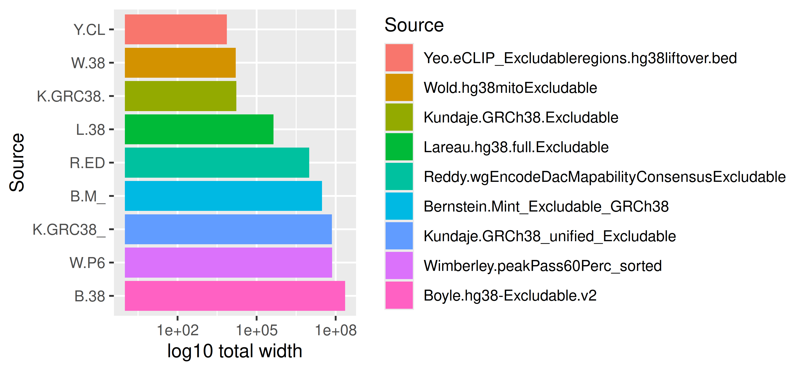
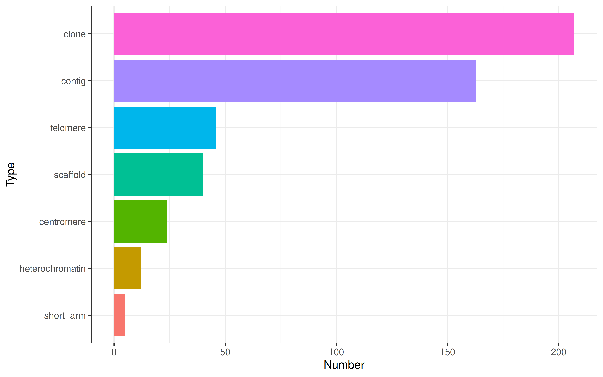

-   <a href="#excluderanges---genomic-ranges-of-problematic-genomic-regions"
    id="toc-excluderanges---genomic-ranges-of-problematic-genomic-regions">excluderanges
    - genomic ranges of problematic genomic regions</a>
-   <a href="#install-excluderanges" id="toc-install-excluderanges">Install
    <code>excluderanges</code></a>
-   <a href="#use-excluderanges" id="toc-use-excluderanges">Use
    excluderanges</a>
    -   <a href="#compare-the-number-of-excludable-regions"
        id="toc-compare-the-number-of-excludable-regions">Compare the number of
        excludable regions</a>
    -   <a href="#compare-the-width-of-excludable-regions"
        id="toc-compare-the-width-of-excludable-regions">Compare the width of
        excludable regions</a>
    -   <a href="#compare-overlaps-among-sets"
        id="toc-compare-overlaps-among-sets">Compare overlaps among sets</a>
    -   <a href="#metadata-analysis" id="toc-metadata-analysis">Metadata
        analysis</a>
-   <a href="#bedbase-data-download" id="toc-bedbase-data-download">BEDbase
    data download</a>
-   <a href="#mitochondrial-dna-sequences-numts"
    id="toc-mitochondrial-dna-sequences-numts">Mitochondrial DNA sequences,
    NUMTs</a>
-   <a href="#centromeres-telomeres-etc"
    id="toc-centromeres-telomeres-etc">Centromeres, telomeres, etc.</a>
-   <a href="#summary-table" id="toc-summary-table">Summary table</a>
-   <a href="#citation" id="toc-citation">Citation</a>
-   <a href="#code-of-conduct" id="toc-code-of-conduct">Code of Conduct</a>
-   <a href="#references" id="toc-references">References</a>

<!-- README.md is generated from README.Rmd. Please edit that file -->

# excluderanges - genomic ranges of problematic genomic regions


Coordinates of problematic genomic regions that should be avoided when
working with genomic data. For human, mouse, and selected model
organisms.

<!-- badges: start
[](https://lifecycle.r-lib.org/articles/stages.html#experimental)
badges: end -->

**New** - Exclusion sets for human
[T2T-CHM13](http://bedbase.org/#/bedsplash/6548a002754cc1e882035293541b59a8)
and mouse
[GRCm39/mm39](http://bedbase.org/#/bedsplash/edc716833d4b5ee75c34a0692fc353d5)
genome assemblies are available.

**TL;DR** - For human hg38 genome assembly,
[Anshul](https://twitter.com/anshulkundaje/status/1263546023151992832?s=20)
and we recommend [ENCFF356LFX exclusion list
regions](https://www.encodeproject.org/files/ENCFF356LFX/). Also
available as `hg38.Kundaje.GRCh38_unified_Excludable` excluderanges
object (AnnotationHub ID: AH95917) and
[BEDbase.org](http://bedbase.org/#/bedsplash/1a561729234c2844303a051b16f66656).

BED files of exclusion regions are available on the [ENCODE
project](https://www.encodeproject.org/search/?searchTerm=exclusion+list)
website and scattered across various websites, such as
[Blacklist](https://github.com/Boyle-Lab/Blacklist/tree/master/lists)
(Amemiya, Kundaje, and Boyle 2019),
[Peakpass](https://github.com/ewimberley/peakPass/tree/main/excludedlists)
(Wimberley and Heber 2019),
[Greenscreen](https://github.com/sklasfeld/GreenscreenProject/tree/main/data)
(Klasfeld and Wagner 2022). Human and mouse genome assemblies have the
largest number of exclusion sets generated by multiple labs. These
exclusion sets frequently lack annotation and curation methods, creating
uncertainty what to use. The purpose of this package is to provide a
unified place for informed retrieval of exclusion regions.

Naming convention: `<genome assembly>.<lab>.<original file name>`, e.g.,
`hg19.Birney.wgEncodeDacMapabilityConsensusExcludable`.

See [make-data.R](inst/scripts/make-data.R) how we created excluderanges
objects.

# Install `excluderanges`

``` r
if (!requireNamespace("BiocManager", quietly = TRUE)) {
    install.packages("BiocManager")
}
# Install the development version of Bioconductor (need 3.15 or above)
# BiocManager::install(version = "devel")
# Check that you have a valid Bioconductor installation
# BiocManager::valid()
# Install the package
BiocManager::install("excluderanges", version = "devel")

# BiocManager::install("dozmorovlab/excluderanges")
```

# Use excluderanges

Get an overview of what’s available

``` r
suppressMessages(library(GenomicRanges))
#> Warning: package 'IRanges' was built under R version 4.2.1
#> Warning: package 'GenomeInfoDb' was built under R version 4.2.1
suppressMessages(library(AnnotationHub))
ah <- AnnotationHub()
#> snapshotDate(): 2022-04-25
query_data <- query(ah, "excluderanges")
# You can search for multiple terms
# query_data <- query(ah, c("excluderanges", "Kundaje"))
query_data
#> AnnotationHub with 42 records
#> # snapshotDate(): 2022-04-25
#> # $dataprovider: UCSC, ENCODE, mitra.stanford.edu/kundaje/akundaje/release/b...
#> # $species: Homo sapiens, Mus musculus, Drosophila melanogaster, Caenorhabdi...
#> # $rdataclass: GRanges
#> # additional mcols(): taxonomyid, genome, description,
#> #   coordinate_1_based, maintainer, rdatadateadded, preparerclass, tags,
#> #   rdatapath, sourceurl, sourcetype 
#> # retrieve records with, e.g., 'object[["AH95908"]]' 
#> 
#>             title                                                    
#>   AH95908 | ce10.Kundaje.ce10-Excludable.rds                         
#>   AH95909 | dm3.Kundaje.dm3-Excludable.rds                           
#>   AH95910 | hg19.Bernstein.Mint_Excludable_hg19.rds                  
#>   AH95911 | hg19.Birney.wgEncodeDacMapabilityConsensusExcludable.rds 
#>   AH95912 | hg19.Crawford.wgEncodeDukeMapabilityRegionsExcludable.rds
#>   ...       ...                                                      
#>   AH95945 | mm10.UCSC.telomere.rds                                   
#>   AH95946 | mm9.UCSC.centromere.rds                                  
#>   AH95947 | mm9.UCSC.contig.rds                                      
#>   AH95948 | mm9.UCSC.fragment.rds                                    
#>   AH95949 | mm10.UCSC.scaffold.rds
```

hg38 excluderanges coordinates recommended by Anshul

``` r
# Check titles
# as.data.frame(mcols(query_data[1:10])["title"]) 
excludeGR.hg38.Kundaje.1 <- query_data[["AH95917"]]
#> loading from cache
# Always a good idea to sort GRanges and keep standard chromosomes
excludeGR.hg38.Kundaje.1 <- excludeGR.hg38.Kundaje.1 %>% 
  sort() %>% keepStandardChromosomes(pruning.mode = "tidy")
excludeGR.hg38.Kundaje.1
#> GRanges object with 910 ranges and 0 metadata columns:
#>         seqnames            ranges strand
#>            <Rle>         <IRanges>  <Rle>
#>     [1]     chr1     628903-635104      *
#>     [2]     chr1   5850087-5850571      *
#>     [3]     chr1   8909610-8910014      *
#>     [4]     chr1   9574580-9574997      *
#>     [5]     chr1 32043823-32044203      *
#>     ...      ...               ...    ...
#>   [906]     chrY 11290797-11334278      *
#>   [907]     chrY 11493053-11592850      *
#>   [908]     chrY 11671014-11671046      *
#>   [909]     chrY 11721528-11749472      *
#>   [910]     chrY 56694632-56889743      *
#>   -------
#>   seqinfo: 24 sequences from hg38 genome
```

Save the data in a BED file, if needed.

``` r
# Note that rtracklayer::import and rtracklayer::export perform unexplained
# start coordinate conversion, likely related to 0- and 1-based coordinate
# system. We recommend converting GRanges to a data frame and save tab-separated
readr::write_tsv(as.data.frame(excludeGR.hg38.Kundaje.1), 
                 file = "hg38.Kundaje.GRCh38_unified_Excludable.bed",
                 col_names = FALSE)
```

We can load other excludable regions for the hg38 genome assembly and
compare them.

``` r
query_data <- query(ah, c("excluderanges", "hg38", "Exclusion regions"))
query_data
#> AnnotationHub with 6 records
#> # snapshotDate(): 2022-04-25
#> # $dataprovider: ENCODE
#> # $species: Homo sapiens
#> # $rdataclass: GRanges
#> # additional mcols(): taxonomyid, genome, description,
#> #   coordinate_1_based, maintainer, rdatadateadded, preparerclass, tags,
#> #   rdatapath, sourceurl, sourcetype 
#> # retrieve records with, e.g., 'object[["AH95915"]]' 
#> 
#>             title                                                       
#>   AH95915 | hg38.Bernstein.Mint_Excludable_GRCh38.rds                   
#>   AH95916 | hg38.Kundaje.GRCh38.Excludable.rds                          
#>   AH95917 | hg38.Kundaje.GRCh38_unified_Excludable.rds                  
#>   AH95918 | hg38.Reddy.wgEncodeDacMapabilityConsensusExcludable.hg38.rds
#>   AH95919 | hg38.Wold.hg38mitoExcludable.rds                            
#>   AH95920 | hg38.Yeo.eCLIP_Excludableregions.hg38liftover.bed.fixed.rds
excludeGR.hg38.Bernstein <- query_data[["AH95915"]]
#> loading from cache
excludeGR.hg38.Kundaje.2 <- query_data[["AH95916"]]
#> loading from cache
excludeGR.hg38.Reddy     <- query_data[["AH95918"]]
#> loading from cache
excludeGR.hg38.Wold      <- query_data[["AH95919"]]
#> loading from cache
excludeGR.hg38.Yeo       <- query_data[["AH95920"]]
#> loading from cache
```

## Compare the number of excludable regions

``` r
library(ggplot2)
mtx_to_plot <- data.frame(Count = c(length(excludeGR.hg38.Bernstein), 
                                    length(excludeGR.hg38.Kundaje.1), 
                                    length(excludeGR.hg38.Kundaje.2), 
                                    length(excludeGR.hg38.Reddy), 
                                    length(excludeGR.hg38.Wold), 
                                    length(excludeGR.hg38.Yeo)),
                          Source = c("Bernstein.Mint_Excludable_GRCh38", 
                                     "Kundaje.GRCh38_unified_Excludable", 
                                     "Kundaje.GRCh38.Excludable", 
                                     "Reddy.wgEncodeDacMapabilityConsensusExcludable", 
                                     "Wold.hg38mitoExcludable", 
                                     "Yeo.eCLIP_Excludableregions.hg38liftover.bed"))
# Order Source by the number of regions
mtx_to_plot$Source <- factor(mtx_to_plot$Source, levels = mtx_to_plot$Source[order(mtx_to_plot$Count)])

ggplot(mtx_to_plot, aes(x = Source, y = Count, fill = Source)) +
  geom_bar(stat = "identity") +
  coord_flip() +
  theme_bw() + theme(legend.position = "none")
```


``` r
# ggsave("man/figures/excluderanges_hg38_count.png", width = 5.5, height = 2)
```

## Compare the width of excludable regions

log2 scale because of heavy right tail distributions.

``` r
library(ggridges)
mtx_to_plot <- data.frame(Width = c(width(excludeGR.hg38.Bernstein), 
                                    width(excludeGR.hg38.Kundaje.1), 
                                    width(excludeGR.hg38.Kundaje.2), 
                                    width(excludeGR.hg38.Reddy), 
                                    width(excludeGR.hg38.Wold), 
                                    width(excludeGR.hg38.Yeo)),
                          Source = c(rep("Bernstein.Mint_Excludable_GRCh38", length(excludeGR.hg38.Bernstein)),
                                     rep("Kundaje.GRCh38_unified_Excludable", length(excludeGR.hg38.Kundaje.1)),
                                     rep("Kundaje.GRCh38.Excludable", length(excludeGR.hg38.Kundaje.2)),
                                     rep("Reddy.wgEncodeDacMapabilityConsensusExcludable", length(excludeGR.hg38.Reddy)),
                                     rep("Wold.hg38mitoExcludable", length(excludeGR.hg38.Wold)),
                                     rep("Yeo.eCLIP_Excludableregions.hg38liftover.bed", length(excludeGR.hg38.Yeo))))

ggplot(mtx_to_plot, aes(x = log2(Width), y = Source, fill = Source)) +
  geom_density_ridges() +
  theme_bw() + theme(legend.position = "none")
#> Picking joint bandwidth of 0.372
```


``` r
# ggsave("man/figures/excluderanges_hg38_width.png", width = 5.5, height = 2)
```

We can investigate the total width of each set of excludable ranges.

``` r
mtx_to_plot <- data.frame(TotalWidth = c(sum(width(excludeGR.hg38.Bernstein)), 
                                         sum(width(excludeGR.hg38.Kundaje.1)), 
                                         sum(width(excludeGR.hg38.Kundaje.2)), 
                                         sum(width(excludeGR.hg38.Reddy)), 
                                         sum(width(excludeGR.hg38.Wold)), 
                                         sum(width(excludeGR.hg38.Yeo))), 
                          Source = c("Bernstein.Mint_Excludable_GRCh38", 
                                     "Kundaje.GRCh38_unified_Excludable", 
                                     "Kundaje.GRCh38.Excludable", 
                                     "Reddy.wgEncodeDacMapabilityConsensusExcludable", 
                                     "Wold.hg38mitoExcludable", 
                                     "Yeo.eCLIP_Excludableregions.hg38liftover"))
ggplot(mtx_to_plot, aes(x = TotalWidth, y = Source, fill = Source)) + 
  geom_bar(stat="identity") + scale_x_log10() + scale_y_discrete(label=abbreviate) +
  xlab("log10 total width")
```



``` r
# ggsave("man/figures/excluderanges_hg38_sumwidth.png", width = 6.5, height = 2)
```

## Compare overlaps among sets

We can compare [overlap
coefficients](https://en.wikipedia.org/wiki/Overlap_coefficient) between
those sets of excludable regions.

``` r
library(pheatmap)
library(stringr)
# Overlap coefficient calculations
overlap_coefficient <- function(gr_a, gr_b) {
  intersects <- GenomicRanges::intersect(gr_a, gr_b, ignore.strand = TRUE)
  intersection_width <- sum(width(intersects))
  min_width <- min(sum(width(gr_a)), sum(width(gr_b)))
  DataFrame(intersection_width, min_width, 
            overlap_coefficient = intersection_width/min_width,
             n_intersections = length(intersects))
}
# List and names of all excludable regions
all_excludeGR_list <- list(excludeGR.hg38.Bernstein, 
                        excludeGR.hg38.Kundaje.1, 
                        excludeGR.hg38.Kundaje.2,
                        excludeGR.hg38.Reddy,
                        excludeGR.hg38.Wold,
                        excludeGR.hg38.Yeo)
all_excludeGR_name <- c("Bernstein.Mint_Excludable_GRCh38", 
                     "Kundaje.GRCh38_unified_Excludable", 
                     "Kundaje.GRCh38.Excludable", 
                     "Reddy.wgEncodeDacMapabilityConsensusExcludable", 
                     "Wold.hg38mitoExcludable", 
                     "Yeo.eCLIP_Excludableregions.hg38liftover")
# Correlation matrix, empty
mtx_to_plot <- matrix(data = 0, nrow = length(all_excludeGR_list), ncol = length(all_excludeGR_list))
# Fill it in
for (i in 1:length(all_excludeGR_list)) {
  for (j in 1:length(all_excludeGR_list)) {
    # If diagonal, set to zero
    if (i == j) mtx_to_plot[i, j] <- 0
    # Process only one half, the other is symmetric
    if (i > j) {
      mtx_to_plot[i, j] <- mtx_to_plot[j, i] <- overlap_coefficient(all_excludeGR_list[[i]], all_excludeGR_list[[j]])[["overlap_coefficient"]]
    }
  }
}
# Trim row/colnames
rownames(mtx_to_plot) <- colnames(mtx_to_plot) <- str_trunc(all_excludeGR_name, width = 25) 
# Save the plot
# png("man/figures/excluderanges_hg38_jaccard.png", width = 1000, height = 900, res = 200)
pheatmap(data.matrix(mtx_to_plot))
```


``` r
# dev.off()
```

## Metadata analysis

Note that some excludable ranges objects contain six columns, implying
there may be some interesting metadata. Let’s explore one.

``` r
mcols(excludeGR.hg38.Reddy)
#> DataFrame with 401 rows and 2 columns
#>                       name     score
#>                <character> <numeric>
#> 1   High_Mappability_isl..      1000
#> 2         Satellite_repeat      1000
#> 3                 BSR/Beta      1000
#> 4   Low_mappability_island      1000
#> 5                 (CATTC)n      1000
#> ...                    ...       ...
#> 397                   TAR1      1000
#> 398       Satellite_repeat      1000
#> 399               (CATTC)n      1000
#> 400               (CATTC)n      1000
#> 401                   TAR1      1000
mtx_to_plot <- table(mcols(excludeGR.hg38.Reddy)[["name"]]) %>%
  as.data.frame()
colnames(mtx_to_plot) <- c("Type", "Number")
mtx_to_plot <- mtx_to_plot[order(mtx_to_plot$Number), ]
mtx_to_plot$Type <- factor(mtx_to_plot$Type, 
                           levels = mtx_to_plot$Type)
ggplot(mtx_to_plot, aes(x = Number, y = Type, fill = Type)) +
  geom_bar(stat="identity") +
  theme_bw() + theme(legend.position = "none")
```


``` r
# ggsave("man/figures/excluderanges_hg38_Reddy_metadata.png", width = 5, height = 2.5)
```

One may decide to combine the excludable ranges from all labs, although
from previous results we may decide to follow Anshul’s
[advice](https://twitter.com/anshulkundaje/status/1263546023151992832?s=20)
advice about the [ENCFF356LFX exclusion list
regions](https://www.encodeproject.org/files/ENCFF356LFX/) and use the
`excludeGR.hg38.Kundaje.1` object.

``` r
excludeGR.hg38.all <- reduce(c(excludeGR.hg38.Bernstein, 
                               excludeGR.hg38.Kundaje.1, 
                               excludeGR.hg38.Kundaje.2, 
                               excludeGR.hg38.Reddy, 
                               excludeGR.hg38.Wold, 
                               excludeGR.hg38.Yeo))
#> Warning in valid.GenomicRanges.seqinfo(x, suggest.trim = TRUE): GRanges object contains 1 out-of-bound range located on sequence
#>   chr4_GL000008v2_random. Note that ranges located on a sequence whose
#>   length is unknown (NA) or on a circular sequence are not considered
#>   out-of-bound (use seqlengths() and isCircular() to get the lengths and
#>   circularity flags of the underlying sequences). You can use trim() to
#>   trim these ranges. See ?`trim,GenomicRanges-method` for more
#>   information.
# Sort and Keep only standard chromosomes
excludeGR.hg38.all <- excludeGR.hg38.all %>% sort %>% 
  keepStandardChromosomes(pruning.mode = "tidy")
print(length(excludeGR.hg38.all))
#> [1] 13239
summary(width(excludeGR.hg38.all))
#>    Min. 1st Qu.  Median    Mean 3rd Qu.    Max. 
#>       5    1778    2306    8153    2859 5407757
```

# BEDbase data download

[BEDbase.org](http://bedbase.org/) is a repository for storing and
analyzing BED files and BED sets, developed by [Sheffield
lab](https://databio.org/). It provides API for data access and
retrieval.

Using BEDbase ID (e.g., `1a561729234c2844303a051b16f66656` for the
`hg38.Kundaje.GRCh38_unified_Excludable` excluderanges object), we can
construct a URL showing the splash screen with detailed information of
the corresponding object,
<http://bedbase.org/#/bedsplash/1a561729234c2844303a051b16f66656>. We
can also get the BED data.

``` r
suppressMessages(library(httr))
suppressMessages(library(hca))
#> Warning: package 'hca' was built under R version 4.2.1
# bedbase_id
bedbase_id <- "1a561729234c2844303a051b16f66656"
# API token for metadata, we need object "Name"
token1 <- paste0("http://bedbase.org/api/bed/", bedbase_id, "/metadata")
q1 <- GET(token1)
cc1 = httr::content(q1)
# Simplify returned data
lcc1 = lol(cc1) # list of lists
# # Optionally, explore the data
# lol_path(lcc1)
# # Column names
# (lcc1_cols <- lol_pull(lcc1, "columns[*]"))
# # Data for those columns
# (lcc1_data <- lol_lpull(lcc1, "data[*][*]"))
```

``` r
# Construct output file name
fileNameOut <- paste0(lol_pull(lcc1, "data[*][*].Name"), ".bed")
# API token for BED data
token2 <- paste0("http://bedbase.org/api/bed/", bedbase_id, "/file/bed")
# Download file
GET(url = token2, write_disk(fileNameOut, overwrite = TRUE)) # , verbose()
```

# Mitochondrial DNA sequences, NUMTs

Mitochondrial DNA sequences (mtDNA, 100-600K mitochondria per human
cell) transferred to the nucleus give rise to the so-called
mitochondrial DNA sequences in the nuclear genome (NUMTs). In the
settings of DNA/chromatin sequencing (e.g., ATAC-seq), we may observe up
to 80% of mitochondrial sequencing reads that may pile up in the NUMT
sequences. Similar to exclusion sets, genomic regions highly homologous
to mtDNA can be masked to improve biological signal.

The reference human nuclear mitochondrial sequences have been available
in the UCSC genome browser for hg19 and mm8 human/mouse genome
assemblies. We collected NUMT sets for hg38, T2T-CHM13, mm10, generated
by Caleb Lareau in the
[mitoblacklist](https://github.com/caleblareau/mitoblacklist) GitHub
repository. These NUMT sets can be combined with exclusion sets.

Example of the `hg38.Lareau.hg38_peaks` object

``` r
# Get hg38.Lareau.hg38_peaks BEDbase ID
bedbase_id <- "9fa55701a3bd3e7a598d1d2815e3390f"
# Construct output file name
fileNameOut <- "hg38.Lareau.hg38_peak.bed"
# API token for BED data
token2 <- paste0("http://bedbase.org/api/bed/", bedbase_id, "/file/bed")
# Download file
GET(url = token2, write_disk(fileNameOut, overwrite = TRUE)) # , verbose()
#> Response [http://data.bedbase.org/bed_files/hg38.Lareau.hg38_peaks.bed.gz]
#>   Date: 2022-09-19 15:06
#>   Status: 200
#>   Content-Type: application/vnd.realvnc.bed
#>   Size: 11.8 kB
#> <ON DISK>  /Users/mdozmorov/Documents/Work/GitHub/excluderanges/hg38.Lareau.hg38_peak.bed
# Read the data in
hg38.Lareau.hg38_peaks <- readr::read_tsv(fileNameOut, 
                                          col_names = FALSE,
                                          col_types = c("cddcdc"))
# Assign column names depending on the number of columns
all_columns <- c("chr", "start", "stop", "name", "score", "strand", 
                 "signalValue", "pValue", "qValue", "peak")
colnames(hg38.Lareau.hg38_peaks) <- all_columns[1:ncol(hg38.Lareau.hg38_peaks)]
# Convert to GRanges object
hg38.Lareau.hg38_peaks <- makeGRangesFromDataFrame(hg38.Lareau.hg38_peaks, 
                                                   keep.extra.columns = TRUE)
hg38.Lareau.hg38_peaks
#> GRanges object with 784 ranges and 2 metadata columns:
#>         seqnames              ranges strand |                name     score
#>            <Rle>           <IRanges>  <Rle> |         <character> <numeric>
#>     [1]     chr1       628903-635104      * |   peaks/hg38_peak_1   2523899
#>     [2]     chr1     5850087-5850571      * |   peaks/hg38_peak_2     32940
#>     [3]     chr1     8909610-8910014      * |   peaks/hg38_peak_3       123
#>     [4]     chr1     9574580-9574997      * |   peaks/hg38_peak_4     28828
#>     [5]     chr1   32043823-32044203      * |   peaks/hg38_peak_5      8083
#>     ...      ...                 ...    ... .                 ...       ...
#>   [780]     chrX 143431716-143432219      * | peaks/hg38_peak_780     41434
#>   [781]     chrX 143432410-143433212      * | peaks/hg38_peak_781      9271
#>   [782]     chrX 143433510-143434156      * | peaks/hg38_peak_782      5741
#>   [783]     chrX 143543636-143544023      * | peaks/hg38_peak_783      3320
#>   [784]     chrX 146995842-146996224      * | peaks/hg38_peak_784     27222
#>   -------
#>   seqinfo: 23 sequences from an unspecified genome; no seqlengths
```

# Centromeres, telomeres, etc.

Besides the ENCODE-produced excludable regions, we may want to exclude
centromeres, telomeres, and other gap locations. The “Gap Locations”
track for Homo Sapiens is available for the GRcH37/hg19 genome assembly
as a [UCSC ‘gap’
table](http://genome.ucsc.edu/cgi-bin/hgTables?db=hg19&hgta_group=map&hgta_track=gap&hgta_table=gap&hgta_doSchema=describe+table+schema).
It can be retrieved from
*[AnnotationHub](https://bioconductor.org/packages/3.15/AnnotationHub)*,
but lacks the metadata columns needed to decide the type of gaps.

``` r
# Search for the gap track
# ahData <- query(ah, c("gap", "Homo sapiens", "hg19"))
# ahData[ahData$title == "Gap"]
gaps <- ahData[["AH6444"]]
```

The [UCSC ‘gap’
table](http://genome.ucsc.edu/cgi-bin/hgTables?db=hg19&hgta_group=map&hgta_track=gap&hgta_table=gap&hgta_doSchema=describe+table+schema)
provides better granularity about the types of gaps available. E.g., for
human, hg19, we have the following types and the number of gaps.



Those objects are provided as individual GRanges.

Naming convention: `<genome assembly>.UCSC.<gap type>`, e.g.,
`hg19.UCSC.gap_centromere`. We can similarly load any gap type object.

``` r
query_data <- query(ah, c("excluderanges", "UCSC", "Homo Sapiens", "hg19"))
query_data
#> AnnotationHub with 7 records
#> # snapshotDate(): 2022-04-25
#> # $dataprovider: UCSC
#> # $species: Homo sapiens
#> # $rdataclass: GRanges
#> # additional mcols(): taxonomyid, genome, description,
#> #   coordinate_1_based, maintainer, rdatadateadded, preparerclass, tags,
#> #   rdatapath, sourceurl, sourcetype 
#> # retrieve records with, e.g., 'object[["AH95927"]]' 
#> 
#>             title                        
#>   AH95927 | hg19.UCSC.centromere.rds     
#>   AH95928 | hg19.UCSC.clone.rds          
#>   AH95929 | hg19.UCSC.contig.rds         
#>   AH95930 | hg19.UCSC.heterochromatin.rds
#>   AH95931 | hg19.UCSC.scaffold.rds       
#>   AH95932 | hg19.UCSC.short_arm.rds      
#>   AH95933 | hg19.UCSC.telomere.rds

gapsGR_hg19_centromere <- query_data[["AH95927"]]
#> loading from cache
gapsGR_hg19_centromere
#> GRanges object with 24 ranges and 6 metadata columns:
#>       seqnames              ranges strand |       bin        ix           n
#>          <Rle>           <IRanges>  <Rle> | <numeric> <numeric> <character>
#>     2     chr1 121535434-124535434      * |        23      1270           N
#>   184    chr21   11288129-14288129      * |        10        22           N
#>   199    chr22   13000000-16000000      * |        10         3           N
#>   206    chr19   24681782-27681782      * |         1       410           N
#>   224     chrY   10104553-13104553      * |        10       105           N
#>   ...      ...                 ...    ... .       ...       ...         ...
#>   439     chr6   58830166-61830166      * |        16       628           N
#>   453     chr5   46405641-49405641      * |        14       452           N
#>   460     chr4   49660117-52660117      * |         1       447           N
#>   476     chr3   90504854-93504854      * |         2       784           N
#>   481     chr2   92326171-95326171      * |        20       770           N
#>            size        type      bridge
#>       <numeric> <character> <character>
#>     2     3e+06  centromere          no
#>   184     3e+06  centromere          no
#>   199     3e+06  centromere          no
#>   206     3e+06  centromere          no
#>   224     3e+06  centromere          no
#>   ...       ...         ...         ...
#>   439     3e+06  centromere          no
#>   453     3e+06  centromere          no
#>   460     3e+06  centromere          no
#>   476     3e+06  centromere          no
#>   481     3e+06  centromere          no
#>   -------
#>   seqinfo: 24 sequences from hg19 genome
```

# Summary table

[Full summary table](inst/extdata/Table_S1.csv). Download all data from
the [Google Drive
folder](https://drive.google.com/drive/folders/1sF9m8Y3eZouTZ3IEEywjs2kfHOWFBSJT?usp=sharing)

| Name                                                                            | AnnotationHub.ID | BEDbase.URL                                                             | Description                                                                                                                                                                                                                                                                                                  | Filtered.Region.count |
|:--------------------------------------------------------------------------------|:-----------------|:------------------------------------------------------------------------|:-------------------------------------------------------------------------------------------------------------------------------------------------------------------------------------------------------------------------------------------------------------------------------------------------------------|----------------------:|
| T2T.excluderanges                                                               | NA               | [link](http://bedbase.org/#/bedsplash/6548a002754cc1e882035293541b59a8) | Defined by the Boyle-Lab/Blacklist software, High Signal and Low Mappability regions                                                                                                                                                                                                                         |                  3565 |
| hg38.Kundaje.GRCh38_unified_Excludable                                          | AH95917          | [link](http://bedbase.org/#/bedsplash/1a561729234c2844303a051b16f66656) | Defined as a combination of hg38.Lareau.hg38_peaks, hg38.Boyle.hg38-Excludable.v2, and hg38.Wimberley.peakPass60Perc_sorted, followed by manual curation. Supersedes hg38.Kundaje.GRCh38.Excludable.                                                                                                         |                   910 |
| hg38.Bernstein.Mint_Excludable_GRCh38                                           | AH95915          | [link](http://bedbase.org/#/bedsplash/80e335903b77b597b8245f9817fcd9cd) | Defined from Mint-ChIP (low input, multiplexed ChIP-seq) data                                                                                                                                                                                                                                                |                 12052 |
| hg38.Boyle.hg38-Excludable.v2                                                   | NA               | [link](http://bedbase.org/#/bedsplash/ac58962c9ec98fe9258c12092a0c8832) | Defined by the Boyle-Lab/Blacklist software, High Signal and Low Mappability regions                                                                                                                                                                                                                         |                   636 |
| hg38.Kundaje.GRCh38.Excludable                                                  | AH95916          | [link](http://bedbase.org/#/bedsplash/cb701496bde7eeb18add96fdbc3b8b11) | Defined by Anshul Kundaje as a part of ENCODE and modENCODE consortia                                                                                                                                                                                                                                        |                    38 |
| hg38.Lareau.hg38.full.Excludable                                                | NA               | [link](http://bedbase.org/#/bedsplash/5a12c1de138ace1a73a45e6faf9ba669) | ENCODE excludable regions combined with regions of high homology to mtDNA (NUMT regions)                                                                                                                                                                                                                     |                   820 |
| hg38.Reddy.wgEncodeDacMapabilityConsensusExcludable.hg38                        | AH95918          | [link](http://bedbase.org/#/bedsplash/148622e896f6798f7c4abf448bab67c4) | Defined by the ENCODE consortium, includes satellite repeats (CATTC, GAATG, GAGTG, ACRO1), RepeatMasker repeats (ALR/Alpha, BSR/Beta), centromeric repeats, chrM, High/Low mappability islands. Has extra chromosomes, use keepStandardChromosomes() filtering                                               |                   396 |
| hg38.Wimberley.peakPass60Perc_sorted                                            | NA               | [link](http://bedbase.org/#/bedsplash/f4a9bb19ed29e993592813e970e7dd90) | Defined by the ewimberley/peakPass software                                                                                                                                                                                                                                                                  |                  5078 |
| hg38.Wold.hg38mitoExcludable                                                    | AH95919          | [link](http://bedbase.org/#/bedsplash/a714dcba99821801b5c426fba9c80988) | Definition method unknown                                                                                                                                                                                                                                                                                    |                   299 |
| hg38.Yeo.eCLIP_Excludableregions.hg38liftover.bed.fixed                         | AH95920          | [link](http://bedbase.org/#/bedsplash/1a02a65fafefefd65ff4a060273304ed) | Defined from eCLIP data                                                                                                                                                                                                                                                                                      |                    56 |
| hg19.Boyle.hg19-Excludable.v2                                                   | NA               | [link](http://bedbase.org/#/bedsplash/6eb180d456f2f3b71b419e5fab107fc9) | Defined by the Boyle-Lab/Blacklist software, High Signal and Low Mappability regions                                                                                                                                                                                                                         |                   834 |
| hg19.Bernstein.Mint_Excludable_hg19                                             | AH95910          | [link](http://bedbase.org/#/bedsplash/d1a6047ed5bec84acefe9c52cf63b593) | Defined from Mint-ChIP (low input, multiplexed ChIP-seq) data                                                                                                                                                                                                                                                |                  9035 |
| hg19.Birney.wgEncodeDacMapabilityConsensusExcludable                            | AH95911          | [link](http://bedbase.org/#/bedsplash/5b6b19dea85a8bc6007ef07a0960267b) | Defined by the ENCODE consortium, includes satellite repeats (CATTC, GAATG, GAGTG, ACRO1), RepeatMasker repeats (ALR/Alpha, BSR/Beta), centromeric repeats, chrM, High/Low mappability islands                                                                                                               |                   411 |
| hg19.Crawford.wgEncodeDukeMapabilityRegionsExcludable                           | AH95912          | [link](http://bedbase.org/#/bedsplash/dac2eda4e8687eb039611ac6cd595821) | Defined by the ENCODE consortium, includes satellite repeats (CATTC, GAATG, GAGTG, ACRO1), RepeatMasker repeats (ALR/Alpha, BSR/Beta), human satellite repeat HSATII, chrM, ribosomal subunit consensus sequences LSU-rRNA_Hsa, SSU-rRNA_Hsa. Has extra chromosomes, use keepStandardChromosomes() filtering |                  1566 |
| hg19.Lareau.hg19.full.Excludable                                                | NA               | [link](http://bedbase.org/#/bedsplash/d934d47e8035da9c5a1767c8153db4cc) | ENCODE excludable regions combined with regions of high homology to mtDNA (NUMT regions)                                                                                                                                                                                                                     |                   902 |
| hg19.Wold.hg19mitoExcludable                                                    | AH95913          | [link](http://bedbase.org/#/bedsplash/182046a0f055b0176178241a95cbd637) | Definition method unknown                                                                                                                                                                                                                                                                                    |                   295 |
| hg19.Yeo.eCLIP_Excludableregions.hg19                                           | AH95914          | [link](http://bedbase.org/#/bedsplash/350f49dc47e5307109e1e17d60223a31) | Defined from eCLIP data, includes skyscraper, rRNA pseudogene, unreliably mapped satellite repeat, and low complexity skyscraper peak regions                                                                                                                                                                |                    57 |
| mm39.excluderanges                                                              | NA               | [link](http://bedbase.org/#/bedsplash/edc716833d4b5ee75c34a0692fc353d5) | Defined by the Boyle-Lab/Blacklist software, High Signal and Low Mappability regions                                                                                                                                                                                                                         |                  3147 |
| mm10.Boyle.mm10-Excludable.v2                                                   | NA               | [link](http://bedbase.org/#/bedsplash/a5311e39fe1590de66c1df6a5881a942) | Defined by the Boyle-Lab/Blacklist software, High Signal and Low Mappability regions                                                                                                                                                                                                                         |                  3435 |
| mm10.Hardison.Excludable.full                                                   | AH95921          | [link](http://bedbase.org/#/bedsplash/087541f51cf8c7d7078995d1bd95fd27) | Definition method unknown                                                                                                                                                                                                                                                                                    |                  7865 |
| mm10.Hardison.psuExcludable.mm10                                                | AH95922          | [link](http://bedbase.org/#/bedsplash/fc6b88f936c5cd880545943708e4c2af) | Definition method unknown                                                                                                                                                                                                                                                                                    |                  5552 |
| mm10.Kundaje.anshul.Excludable.mm10                                             | AH95923          | [link](http://bedbase.org/#/bedsplash/e6a89a8432f4a69bae41f60ed0c7e704) | Defined by Anshul Kundaje as a part of ENCODE and modENCODE consortia                                                                                                                                                                                                                                        |                  3010 |
| mm10.Kundaje.mm10.Excludable                                                    | AH95924          | [link](http://bedbase.org/#/bedsplash/76c03b6c831f8fecdf4fee7adf2def6a) | Defined by Anshul Kundaje as a part of ENCODE and modENCODE consortia                                                                                                                                                                                                                                        |                   164 |
| mm10.Lareau.mm10.full.Excludable                                                | NA               | [link](http://bedbase.org/#/bedsplash/1bd30517be79d4d051308c693b822798) | ENCODE excludable regions combined with regions of high homology to mtDNA (NUMT regions)                                                                                                                                                                                                                     |                   523 |
| mm10.Wold.mm10mitoExcludable                                                    | AH95925          | [link](http://bedbase.org/#/bedsplash/830f1ffd31689e3e7c22ff856f0ba02c) | Definition method unknown                                                                                                                                                                                                                                                                                    |                   123 |
| mm9.Lareau.mm9.full.Excludable                                                  | NA               | [link](http://bedbase.org/#/bedsplash/e903b285baefce8167367ce57a8c3d48) | ENCODE excludable regions combined with regions of high homology to mtDNA (NUMT regions)                                                                                                                                                                                                                     |                  3415 |
| mm9.Wold.mm9mitoExcludable                                                      | AH95926          | [link](http://bedbase.org/#/bedsplash/9b4389a6a4b937df8abd62dad30fa3a3) | Definition method unknown                                                                                                                                                                                                                                                                                    |                   123 |
| ce11.Boyle.ce11-Excludable.v2                                                   | NA               | [link](http://bedbase.org/#/bedsplash/7235114a78b1709be96f0d6a82b4ea36) | Defined by the Boyle-Lab/Blacklist software, High Signal and Low Mappability regions                                                                                                                                                                                                                         |                    97 |
| ce10.Boyle.ce10-Excludable.v2                                                   | NA               | [link](http://bedbase.org/#/bedsplash/6de11bb5f50ee015b23ac96f433f00bb) | Defined by the Boyle-Lab/Blacklist software, High Signal and Low Mappability regions                                                                                                                                                                                                                         |                   100 |
| ce10.Kundaje.ce10-Excludable                                                    | AH95908          | [link](http://bedbase.org/#/bedsplash/32b59590fa83161687cec4cabfa2bb2b) | Defined by Anshul Kundaje, superseded by ce10.Boyle.ce10-Excludable.v2                                                                                                                                                                                                                                       |                   122 |
| danRer10.Domingues.Excludableed                                                 | NA               | [link](http://bedbase.org/#/bedsplash/a0a94af275f858d63550005627d260b7) | Defined manually using total RNA-seq.                                                                                                                                                                                                                                                                        |                    57 |
| danRer10.Yang.Supplemental_Table_19.ChIP-seq_black_list_in_the_zebrafish_genome | NA               | [link](http://bedbase.org/#/bedsplash/78f5eb585019a4d795ef80159a597b15) | Defined via MACS2 peak calling using ChIP-seq (PMID: 33239788)                                                                                                                                                                                                                                               |                   853 |
| dm6.Boyle.dm6-Excludable.v2                                                     | NA               | [link](http://bedbase.org/#/bedsplash/24186dc2aac492074d3de9caede730a0) | Defined by the Boyle-Lab/Blacklist software, High Signal and Low Mappability regions                                                                                                                                                                                                                         |                   182 |
| dm3.Boyle.dm3-Excludable.v2                                                     | NA               | [link](http://bedbase.org/#/bedsplash/7427399e18d9c01e423b2f4963b409ea) | Defined by the Boyle-Lab/Blacklist software, High Signal and Low Mappability regions                                                                                                                                                                                                                         |                   248 |
| dm3.Kundaje.dm3-Excludable                                                      | AH95909          | [link](http://bedbase.org/#/bedsplash/0801a522159f7ebf2f669d8cade4aa8f) | Defined by Anshul Kundaje. Contains heterochromatin chromosomes chr2LHet. Superseded by dm3.Boyle.dm3-Excludable.v2                                                                                                                                                                                          |                   306 |
| TAIR10.Wimberley.predicted_excluded_list_sorted_0.6                             | NA               | [link](http://bedbase.org/#/bedsplash/6f3a3ae3ee878b88a92093eb8e3fe982) | Defined by the ewimberley/peakPass software                                                                                                                                                                                                                                                                  |                   887 |
| TAIR10.Klasfeld.arabidopsis_Excludable_20inputs                                 | NA               | [link](http://bedbase.org/#/bedsplash/aa1c99c2dd2aef874486b1c0c3bf6b92) | Defined by the Boyle-Lab/Blacklist software, High Signal and Low Mappability regions (DOI: 10.1101/2022.02.27.482177)                                                                                                                                                                                        |                    83 |
| TAIR10.Klasfeld.arabidopsis_greenscreen_20inputs                                | NA               | [link](http://bedbase.org/#/bedsplash/e5d66ee787a8cb0c76438bba768c2331) | Defined by the green screen pipeline (DOI: 10.1101/2022.02.27.482177)                                                                                                                                                                                                                                        |                    36 |
| T2T.Lareau.chm13v2.0_peaks                                                      | NA               | [link](http://bedbase.org/#/bedsplash/354dfced295f54f70ae9656ca8f9b141) | Regions of high homology to mtDNA (NUMT regions) defined by caleblareau/mitoblacklist                                                                                                                                                                                                                        |                   817 |
| hg38.Lareau.hg38_peaks                                                          | NA               | [link](http://bedbase.org/#/bedsplash/9fa55701a3bd3e7a598d1d2815e3390f) | Regions of high homology to mtDNA (NUMT regions) defined by caleblareau/mitoblacklist                                                                                                                                                                                                                        |                   784 |
| hg19.Lareau.hg19_peaks                                                          | NA               | [link](http://bedbase.org/#/bedsplash/79e924141251afbd4cde0c38456913fd) | Regions of high homology to mtDNA (NUMT regions) defined by caleblareau/mitoblacklist                                                                                                                                                                                                                        |                   779 |
| mm10.Lareau.mm10_peaks                                                          | NA               | [link](http://bedbase.org/#/bedsplash/1b76ab775549e116da5e1a89aad7019b) | Regions of high homology to mtDNA (NUMT regions) defined by caleblareau/mitoblacklist                                                                                                                                                                                                                        |                   387 |
| mm9.Lareau.mm9_peaks                                                            | NA               | [link](http://bedbase.org/#/bedsplash/5c4b1cb28175b72bc56adb0bd7384dfd) | Regions of high homology to mtDNA (NUMT regions) defined by caleblareau/mitoblacklist                                                                                                                                                                                                                        |                   395 |
| hg19.UCSC.numtS                                                                 | NA               | NA                                                                      | Human NumtS mitochondrial sequence                                                                                                                                                                                                                                                                           |                   766 |
| mm9.UCSC.numtS                                                                  | NA               | NA                                                                      | Mouse NumtS mitochondrial sequence                                                                                                                                                                                                                                                                           |                   172 |
| T2T.CHM13.chm13.draft_v2.0.cen_mask                                             | NA               | NA                                                                      | Centromeric satellite masking bed file (v2.0)                                                                                                                                                                                                                                                                |                    23 |
| T2T.CHM13.chm13.draft_v1.1.telomere                                             | NA               | NA                                                                      | Telomere identified by the VGP pipeline (v1.1)                                                                                                                                                                                                                                                               |                    48 |
| T2T.UCSC.censat                                                                 | NA               | NA                                                                      | T2T peri/centromeric satellite annotation (v2.0, 20220329, CHM13 v2.0)                                                                                                                                                                                                                                       |                  2523 |
| T2T.UCSC.gap                                                                    | NA               | NA                                                                      | Locations of assembly gaps, as determine by strings of ‘N’ characters (v1.0)                                                                                                                                                                                                                                 |                     5 |
| T2T.UCSC.hgUnique.hg38                                                          | NA               | NA                                                                      | Regions unique to the T2T-CHM13 v2.0 assembly compared to the GRCh38/hg38 and GRCh37/hg19 reference assemblies                                                                                                                                                                                               |                   615 |
| hg38.UCSC.centromere                                                            | NA               | NA                                                                      | Gaps from centromeres                                                                                                                                                                                                                                                                                        |                   109 |
| hg38.UCSC.telomere                                                              | AH95938          | NA                                                                      | Gaps from telomeres                                                                                                                                                                                                                                                                                          |                    48 |
| hg38.UCSC.short_arm                                                             | AH95937          | NA                                                                      | Gaps on the short arm of the chromosome                                                                                                                                                                                                                                                                      |                     5 |
| hg38.UCSC.heterochromatin                                                       | AH95935          | NA                                                                      | Gaps from large blocks of heterochromatin                                                                                                                                                                                                                                                                    |                    11 |
| hg38.UCSC.contig                                                                | AH95934          | NA                                                                      | Gaps between contigs in scaffolds                                                                                                                                                                                                                                                                            |                   285 |
| hg38.UCSC.scaffold                                                              | AH95936          | NA                                                                      | Gaps between scaffolds in chromosome assemblies. Has extra chromosomes, use keepStandardChromosomes() filtering                                                                                                                                                                                              |                   254 |
| hg19.UCSC.centromere                                                            | AH95927          | NA                                                                      | Gaps from centromeres                                                                                                                                                                                                                                                                                        |                    24 |
| hg19.UCSC.telomere                                                              | AH95933          | NA                                                                      | Gaps from telomeres                                                                                                                                                                                                                                                                                          |                    46 |
| hg19.UCSC.short_arm                                                             | AH95932          | NA                                                                      | Gaps on the short arm of the chromosome                                                                                                                                                                                                                                                                      |                     5 |
| hg19.UCSC.heterochromatin                                                       | AH95930          | NA                                                                      | Gaps from large blocks of heterochromatin                                                                                                                                                                                                                                                                    |                    12 |
| hg19.UCSC.clone                                                                 | AH95928          | NA                                                                      | Gaps between clones in the same map contig. Has extra chromosomes, use keepStandardChromosomes() filtering                                                                                                                                                                                                   |                   107 |
| hg19.UCSC.contig                                                                | AH95929          | NA                                                                      | Gaps between contigs in scaffolds                                                                                                                                                                                                                                                                            |                   163 |
| hg19.UCSC.scaffold                                                              | AH95931          | NA                                                                      | Gaps between scaffolds in chromosome assemblies. Only non-autosomal chromosomes                                                                                                                                                                                                                              |                     0 |
| mm39.UCSC.centromere                                                            | NA               | NA                                                                      | Gaps from centromeres                                                                                                                                                                                                                                                                                        |                    20 |
| mm39.UCSC.telomere                                                              | NA               | NA                                                                      | Gaps from telomeres                                                                                                                                                                                                                                                                                          |                    42 |
| mm39.UCSC.short_arm                                                             | NA               | NA                                                                      | Gaps on the short arm of the chromosome                                                                                                                                                                                                                                                                      |                    21 |
| mm39.UCSC.contig                                                                | NA               | NA                                                                      | Gaps between contigs in scaffolds                                                                                                                                                                                                                                                                            |                    60 |
| mm39.UCSC.scaffold                                                              | NA               | NA                                                                      | Gaps between scaffolds in chromosome assemblies                                                                                                                                                                                                                                                              |                   115 |
| mm10.UCSC.centromere                                                            | AH95939          | NA                                                                      | Gaps from centromeres                                                                                                                                                                                                                                                                                        |                    20 |
| mm10.UCSC.telomere                                                              | AH95945          | NA                                                                      | Gaps from telomeres                                                                                                                                                                                                                                                                                          |                    42 |
| mm10.UCSC.short_arm                                                             | AH95944          | NA                                                                      | Gaps on the short arm of the chromosome                                                                                                                                                                                                                                                                      |                    21 |
| mm10.UCSC.clone                                                                 | AH95940          | NA                                                                      | Gaps between clones in the same map contig. Has extra chromosomes, use keepStandardChromosomes() filtering                                                                                                                                                                                                   |                     4 |
| mm10.UCSC.contig                                                                | AH95941          | NA                                                                      | Gaps between contigs in scaffolds                                                                                                                                                                                                                                                                            |                   104 |
| mm10.UCSC.scaffold                                                              | AH95949          | NA                                                                      | Gaps between scaffolds in chromosome assemblies                                                                                                                                                                                                                                                              |                     0 |
| mm10.UCSC.other                                                                 | AH95943          | NA                                                                      | Sequence of Ns in the assembly that were not marked as gaps in the AGP (A Golden Path) assembly definition file. Has extra chromosomes, use keepStandardChromosomes() filtering                                                                                                                              |                   383 |
| mm10.UCSC.fragment                                                              | AH95942          | NA                                                                      | A single gap of 31 bases in chrX_GL456233_random                                                                                                                                                                                                                                                             |                     0 |
| mm9.UCSC.centromere                                                             | AH95946          | NA                                                                      | Gaps from centromeres                                                                                                                                                                                                                                                                                        |                    21 |
| mm9.UCSC.fragment                                                               | AH95948          | NA                                                                      | Gaps between the contigs of a draft clone. (In this context, a contig is a set of overlapping sequence reads). Has extra chromosomes, use keepStandardChromosomes() filtering                                                                                                                                |                   436 |
| mm9.UCSC.contig                                                                 | AH95947          | NA                                                                      | Gaps between contigs in scaffolds. Has extra chromosomes, use keepStandardChromosomes() filtering                                                                                                                                                                                                            |                   105 |
| danRer10.UCSC.contig                                                            | NA               | NA                                                                      | Gaps between contigs in scaffolds                                                                                                                                                                                                                                                                            |                  2338 |
| danRer10.UCSC.scaffold                                                          | NA               | NA                                                                      | Gaps between scaffolds in chromosome assemblies                                                                                                                                                                                                                                                              |                 16496 |
| dm6.UCSC.other                                                                  | NA               | NA                                                                      | Sequence of Ns in the assembly that were not marked as gaps in the AGP (A Golden Path) assembly definition file                                                                                                                                                                                              |                   268 |
| dm3.UCSC.contig                                                                 | NA               | NA                                                                      | Gaps between contigs in scaffolds                                                                                                                                                                                                                                                                            |                     7 |
| dm3.UCSC.scaffold                                                               | NA               | NA                                                                      | Gaps between scaffolds in chromosome assemblies                                                                                                                                                                                                                                                              |                     1 |
| TAIR10.UCSC.araTha1.gap                                                         | NA               | NA                                                                      | Gaps in the May 2011 Arabidopsis thaliana genome assembly                                                                                                                                                                                                                                                    |                   357 |

# Citation

Below is the citation output from using `citation('excluderanges')` in
R. Please run this yourself to check for any updates on how to cite
**excluderanges**.

``` r
print(citation("excluderanges"), bibtex = TRUE)
```

# Code of Conduct

Please note that the `excluderanges` project is released with a
[Contributor Code of
Conduct](https://bioconductor.github.io/bioc_coc_multilingual/). By
contributing to this project, you agree to abide by its terms.

This package was developed using
*[biocthis](https://bioconductor.org/packages/3.15/biocthis)*.

# References

<div id="refs" class="references csl-bib-body hanging-indent">

<div id="ref-Amemiya:2019aa" class="csl-entry">

Amemiya, Haley M, Anshul Kundaje, and Alan P Boyle. 2019. “The ENCODE
Blacklist: Identification of Problematic Regions of the Genome.” *Sci
Rep* 9 (1): 9354. <https://doi.org/10.1038/s41598-019-45839-z>.

</div>

<div id="ref-Klasfeld2022-nn" class="csl-entry">

Klasfeld, Sammy, and Doris Wagner. 2022. “Greenscreen Decreases Type I
Errors and Increases True Peak Detection in Genomic Datasets Including
<span class="nocase">ChIP-seq</span>.” *bioRxiv*.

</div>

<div id="ref-Wimberley:2019ub" class="csl-entry">

Wimberley, Charles E, and Steffen Heber. 2019. “PeakPass: Automating
ChIP-Seq Blacklist Creation.” *J Comput Biol*, December.
<https://doi.org/10.1089/cmb.2019.0295>.

</div>

</div>
